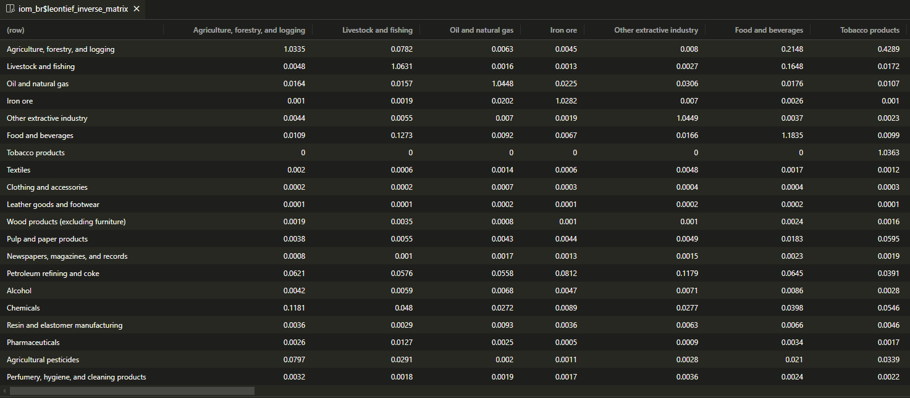

---
output:
  github_document:
    html_preview: false
---

<!-- README.md is generated from README.Rmd. Please edit that file -->

```{r, include = FALSE}
knitr::opts_chunk$set(
  collapse = TRUE,
  comment = "#>",
  fig.path = "man/figures/README-"
)
```

# {fio}
<div style="text-align: justify">
Friendly & Fast Input-Output Analysis 

<!-- badges: start -->
[](https://github.com/albersonmiranda/fio/actions/workflows/R-CMD-check.yaml)
[](https://lifecycle.r-lib.org/articles/stages.html#experimental)
[](https://CRAN.R-project.org/package=fio)
<!-- badges: end -->

`{fio}` (*Friendly Input-Output*) is a R package designed for input-output analysis, emphasizing usability for Excel users and performance. It includes an [RStudio Addin](https://rstudio.github.io/rstudioaddins/) and a suite of functions for straightforward import of input-output tables from Excel, either programmatically or directly from the clipboard.

The package is optimized for speed and efficiency. It leverages the [R6 class](https://r6.r-lib.org/) for clean, memory-efficient object-oriented programming. Furthermore, all linear algebra computations are implemented in [Rust](https://www.rust-lang.org/) to achieve highly optimized performance.

## Installation

To install a precompiled version for Windows or Linux, visit the [Releases section](https://github.com/albersonmiranda/fio/releases).

If you have [Rust](https://www.rust-lang.org/) installed and wish to compile the latest development version from source, use:

``` r
devtools::install_github("albersonmiranda/fio")
```

## Getting Started

If you are just getting started with `{fio}`, we recommend you to read the [vignettes](https://albersonmiranda.github.io/fio/articles/index.html) for a comprehensive overview of the package.

## Examples

Calculate Leontief's inverse from brazilian 2020 input-output matrix:

```{r example}
# load included dataset
iom_br <- fio::br_2020

# calculate technical coefficients matrix
iom_br$compute_tech_coeff()

# calculate Leontief's inverse
iom_br$compute_leontief_inverse()
```

And pronto! `r emoji::emoji("tada")`, you're all good to carry on with your analysis. You can evoke the Data Viewer to inspect the results with `iom_br$technical_coefficients_matrix |> View()` and `iom_br$leontief_inverse_matrix |> View()`.


*<small>Leontief's inverse from brazilian 2020 input-output matrix</small>*

</div>
