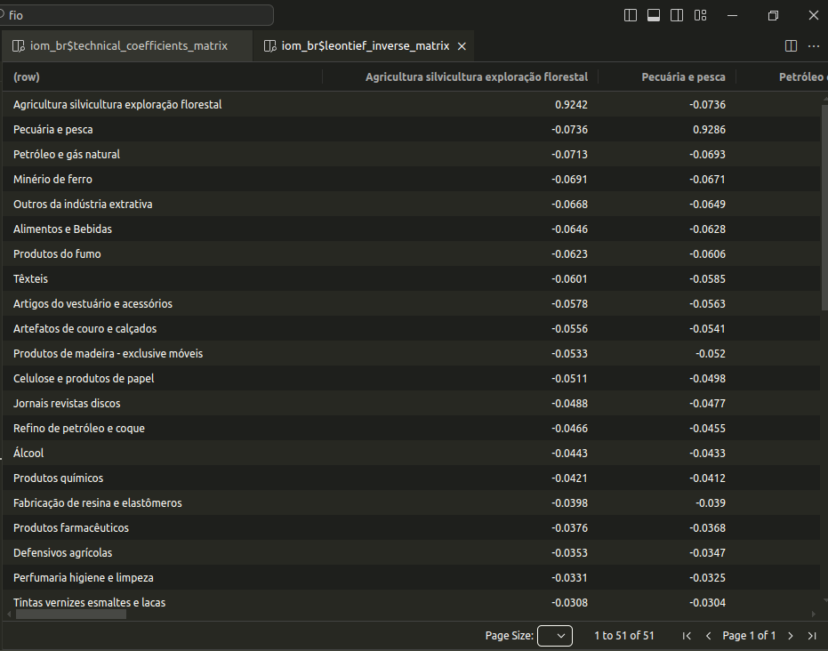

<!-- README.md is generated from README.Rmd. Please edit that file -->

# {fio}

<div style="text-align: justify">

Friendly & Fast Input-Output Analysis


<!-- badges: start -->

[](https://CRAN.R-project.org/package=fio)
[](https://albersonmiranda.r-universe.dev/fio)
[](https://github.com/albersonmiranda/fio/actions/workflows/R-CMD-check.yaml)
[](https://app.codecov.io/gh/albersonmiranda/fio?branch=main)
<!-- badges: end -->

`{fio}` (*Friendly Input-Output*) is a R package designed for
input-output analysis, emphasizing usability for Excel users and
performance. It includes an [RStudio
Addin](https://rstudio.github.io/rstudioaddins/) and a suite of
functions for straightforward import of input-output tables from Excel,
either programmatically or directly from the clipboard.

The package is optimized for speed and efficiency. It leverages the [R6
class](https://r6.r-lib.org/) for clean, memory-efficient
object-oriented programming. Furthermore, all linear algebra
computations are implemented in [Rust](https://www.rust-lang.org/) to
achieve highly optimized performance.

## Installation

### CRAN Release

You can install the latest stable release of {fio} from CRAN with:

``` r
install.packages("fio")
```

### Latest Tested version

install the latest tested but unreleased version from the [main
branch](https://github.com/albersonmiranda/fio/tree/main), use the
precompiled binaries available on
[R-universe](https://albersonmiranda.r-universe.dev/fio):

``` r
install.packages("fio", repos = c("https://albersonmiranda.r-universe.dev", "https://cloud.r-project.org"))
```

### Development version

For the cutting-edge development version from the [dev
branch](https://github.com/albersonmiranda/fio/tree/dev), you’ll need to
compile it from source. This requires [Rust](https://www.rust-lang.org/)
to be installed on your system. You can install Rust using the following
commands:

- Debian/Ubuntu: `apt-get install cargo`
- Fedora/CentOS: `dnf install cargo`
- macOS: `brew install rustc`
- Windows: <https://www.rust-lang.org/tools/install>

## Getting Started

If you are just getting started with `{fio}`, we recommend you to read
the
[vignettes](https://albersonmiranda.github.io/fio/articles/index.html)
for a comprehensive overview of the package.

## Examples

Calculate Leontief’s inverse from brazilian 2020 input-output matrix:

``` r
# load included dataset
iom_br <- fio::br_2020

# calculate technical coefficients matrix
iom_br$compute_tech_coeff()

# calculate Leontief's inverse
iom_br$compute_leontief_inverse()
```

And pronto! 🎉, you’re all good to carry on with your analysis. You can
evoke the Data Viewer to inspect the results with
`iom_br$technical_coefficients_matrix |> View()` and
`iom_br$leontief_inverse_matrix |> View()`.

 *<small>Leontief’s inverse
from brazilian 2020 input-output matrix</small>*

## Related tools

Other great tools for input-output analysis in R include:

- [{leontief}](https://pachamaltese.github.io/leontief/)
- [{ioanalysis}](https://cran.r-project.org/package=ioanalysis)

</div>
