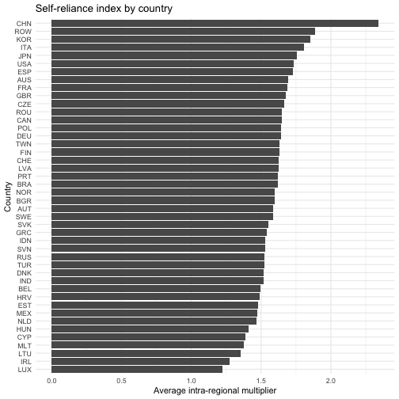
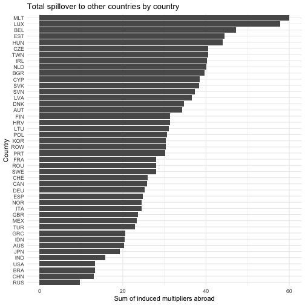
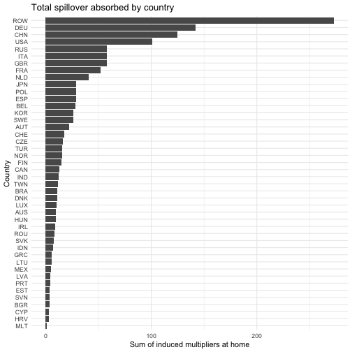
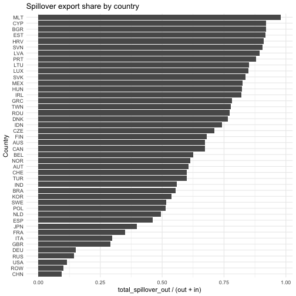

# WIOD 2014 Analysis

## Introduction

This vignette demonstrates how to use the `fio` package to analyze the
World Input-Output Database (WIOD) 2014 (2016 release). We will use
`fio` to download the data, parse it, create a Multi-Regional
Input-Output Matrix (`miom`) object, and perform various analyses
including technical coefficients, Leontief inverse, multipliers,
bilateral trade, and spillover effects.

## Data

We download the data from the WIOD website and parse it to create a
Multi-Regional Input-Output Matrix (`miom`) object.

``` r

# download wiod 2016 release
fio::download_wiod(year = 2016)
```

This downloads a zip file with the WIOD 2016 release, containing IOTs
from 2000 to 2014. We’ll use the 2014 IOTs for this analysis.

## Creating the MIOM Object

We parse the `wiot` object to create the `miom` object. Calling
[`names()`](https://rdrr.io/r/base/names.html) we find that the `wiot`
object has the following columns:

- IndustryCode
- IndustryDescription
- Country
- RNr
- Year

Then the intermediate transactions matrix, followed by the final demand
matrix.

``` r

# load the data
load("WIOT2014_October16_ROW.RData")

# columns
head(names(wiot), 20)
#>  [1] "IndustryCode"        "IndustryDescription" "Country"            
#>  [4] "RNr"                 "Year"                "AUS1"               
#>  [7] "AUS2"                "AUS3"                "AUS4"               
#> [10] "AUS5"                "AUS6"                "AUS7"               
#> [13] "AUS8"                "AUS9"                "AUS10"              
#> [16] "AUS11"               "AUS12"               "AUS13"              
#> [19] "AUS14"               "AUS15"
```

Expanding the `Country` column, we find that it has 45 unique values,
corresponding to the 44 countries in the WIOD 2014 release plus a
“Total” row. The `IndustryDescription` column has 56 unique values,
corresponding to the 56 sectors in the WIOD 2014 release, plus a total
row for the intermediate transactions matrix and the Value Added matrix.

``` r

# unique countries
unique(wiot$Country)
#>  [1] "AUS" "AUT" "BEL" "BGR" "BRA" "CAN" "CHE" "CHN" "CYP" "CZE" "DEU" "DNK"
#> [13] "ESP" "EST" "FIN" "FRA" "GBR" "GRC" "HRV" "HUN" "IDN" "IND" "IRL" "ITA"
#> [25] "JPN" "KOR" "LTU" "LUX" "LVA" "MEX" "MLT" "NLD" "NOR" "POL" "PRT" "ROU"
#> [37] "RUS" "SVK" "SVN" "SWE" "TUR" "TWN" "USA" "ROW" "TOT"

# unique sectors
unique(wiot$IndustryDescription)
#>  [1] "Crop and animal production, hunting and related service activities"                                                                                 
#>  [2] "Forestry and logging"                                                                                                                               
#>  [3] "Fishing and aquaculture"                                                                                                                            
#>  [4] "Mining and quarrying"                                                                                                                               
#>  [5] "Manufacture of food products, beverages and tobacco products"                                                                                       
#>  [6] "Manufacture of textiles, wearing apparel and leather products"                                                                                      
#>  [7] "Manufacture of wood and of products of wood and cork, except furniture; manufacture of articles of straw and plaiting materials"                    
#>  [8] "Manufacture of paper and paper products"                                                                                                            
#>  [9] "Printing and reproduction of recorded media"                                                                                                        
#> [10] "Manufacture of coke and refined petroleum products "                                                                                                
#> [11] "Manufacture of chemicals and chemical products "                                                                                                    
#> [12] "Manufacture of basic pharmaceutical products and pharmaceutical preparations"                                                                       
#> [13] "Manufacture of rubber and plastic products"                                                                                                         
#> [14] "Manufacture of other non-metallic mineral products"                                                                                                 
#> [15] "Manufacture of basic metals"                                                                                                                        
#> [16] "Manufacture of fabricated metal products, except machinery and equipment"                                                                           
#> [17] "Manufacture of computer, electronic and optical products"                                                                                           
#> [18] "Manufacture of electrical equipment"                                                                                                                
#> [19] "Manufacture of machinery and equipment n.e.c."                                                                                                      
#> [20] "Manufacture of motor vehicles, trailers and semi-trailers"                                                                                          
#> [21] "Manufacture of other transport equipment"                                                                                                           
#> [22] "Manufacture of furniture; other manufacturing"                                                                                                      
#> [23] "Repair and installation of machinery and equipment"                                                                                                 
#> [24] "Electricity, gas, steam and air conditioning supply"                                                                                                
#> [25] "Water collection, treatment and supply"                                                                                                             
#> [26] "Sewerage; waste collection, treatment and disposal activities; materials recovery; remediation activities and other waste management services "     
#> [27] "Construction"                                                                                                                                       
#> [28] "Wholesale and retail trade and repair of motor vehicles and motorcycles"                                                                            
#> [29] "Wholesale trade, except of motor vehicles and motorcycles"                                                                                          
#> [30] "Retail trade, except of motor vehicles and motorcycles"                                                                                             
#> [31] "Land transport and transport via pipelines"                                                                                                         
#> [32] "Water transport"                                                                                                                                    
#> [33] "Air transport"                                                                                                                                      
#> [34] "Warehousing and support activities for transportation"                                                                                              
#> [35] "Postal and courier activities"                                                                                                                      
#> [36] "Accommodation and food service activities"                                                                                                          
#> [37] "Publishing activities"                                                                                                                              
#> [38] "Motion picture, video and television programme production, sound recording and music publishing activities; programming and broadcasting activities"
#> [39] "Telecommunications"                                                                                                                                 
#> [40] "Computer programming, consultancy and related activities; information service activities"                                                           
#> [41] "Financial service activities, except insurance and pension funding"                                                                                 
#> [42] "Insurance, reinsurance and pension funding, except compulsory social security"                                                                      
#> [43] "Activities auxiliary to financial services and insurance activities"                                                                                
#> [44] "Real estate activities"                                                                                                                             
#> [45] "Legal and accounting activities; activities of head offices; management consultancy activities"                                                     
#> [46] "Architectural and engineering activities; technical testing and analysis"                                                                           
#> [47] "Scientific research and development"                                                                                                                
#> [48] "Advertising and market research"                                                                                                                    
#> [49] "Other professional, scientific and technical activities; veterinary activities"                                                                     
#> [50] "Administrative and support service activities"                                                                                                      
#> [51] "Public administration and defence; compulsory social security"                                                                                      
#> [52] "Education"                                                                                                                                          
#> [53] "Human health and social work activities"                                                                                                            
#> [54] "Other service activities"                                                                                                                           
#> [55] "Activities of households as employers; undifferentiated goods- and services-producing activities of households for own use"                         
#> [56] "Activities of extraterritorial organizations and bodies"                                                                                            
#> [57] "Total intermediate consumption"                                                                                                                     
#> [58] "taxes less subsidies on products"                                                                                                                   
#> [59] "Cif/ fob adjustments on exports"                                                                                                                    
#> [60] "Direct purchases abroad by residents"                                                                                                               
#> [61] "Purchases on the domestic territory by non-residents "                                                                                              
#> [62] "Value added at basic prices"                                                                                                                        
#> [63] "International Transport Margins"                                                                                                                    
#> [64] "Output at basic prices"

# structure
n_countries <- 44
n_sectors <- 56
n_interm <- n_countries * n_sectors

# extract intermediate transactions matrix
Z <- as.matrix(wiot[1:n_interm, 6:(5 + n_interm)])

# total production vector
x <- as.numeric(wiot[1:n_interm, ncol(wiot)])

# fix zeros to avoid division by zero (NaNs in Leontief Inverse)
# since Z columns are 0 where x is 0, setting x=1 results in A=0/1=0, which is correct
x[x == 0] <- 1

x <- matrix(x, nrow = 1)

# extract countries and sectors
countries_long <- as.character(wiot$Country[1:n_interm])
sectors_long <- as.character(wiot$IndustryCode[1:n_interm])

# get unique values respecting order
countries <- unique(countries_long)
sectors <- unique(sectors_long)

# validating dimensions
if (length(countries) != n_countries) stop("Number of extracted countries does not match expected 44.")
if (length(sectors) != n_sectors) stop("Number of extracted sectors does not match expected 56.")

# create miom object
wiod_miom <- fio::miom$new(
  id = "wiod_2014",
  intermediate_transactions = Z,
  total_production = x,
  countries = countries,
  sectors = sectors
)

print(wiod_miom)
#> <miom>
#>   Inherits from: <iom>
#>   Public:
#>     add: function (matrix_name, matrix) 
#>     allocation_coefficients_matrix: NULL
#>     bilateral_trade: NULL
#>     clone: function (deep = FALSE) 
#>     close_model: function (sectors) 
#>     compute_allocation_coeff: function () 
#>     compute_field_influence: function (epsilon) 
#>     compute_ghosh_inverse: function () 
#>     compute_hypothetical_extraction: function (matrix = "ghosh") 
#>     compute_key_sectors: function (matrix = "leontief") 
#>     compute_leontief_inverse: function () 
#>     compute_multiplier_employment: function () 
#>     compute_multiplier_output: function () 
#>     compute_multiplier_taxes: function () 
#>     compute_multiplier_wages: function () 
#>     compute_multiregional_multipliers: function () 
#>     compute_tech_coeff: function () 
#>     countries: AUS AUT BEL BGR BRA CAN CHE CHN CYP CZE DEU DNK ESP EST  ...
#>     domestic_intermediate_transactions: list
#>     exports: NULL
#>     extract_country: function (country) 
#>     field_influence: NULL
#>     final_demand_matrix: NULL
#>     final_demand_others: NULL
#>     get_bilateral_trade: function (origin_country, destination_country) 
#>     get_country_summary: function () 
#>     get_net_spillover_matrix: function () 
#>     get_regional_interdependence: function () 
#>     get_spillover_matrix: function () 
#>     ghosh_inverse_matrix: NULL
#>     government_consumption: NULL
#>     household_consumption: NULL
#>     hypothetical_extraction: NULL
#>     id: wiod_2014
#>     imports: NULL
#>     initialize: function (id, intermediate_transactions, total_production, countries, 
#>     intermediate_transactions: 12924.1796913047 83.0296371764357 19.1477309183893 115.9 ...
#>     international_intermediate_transactions: list
#>     key_sectors: NULL
#>     leontief_inverse_matrix: NULL
#>     multiplier_employment: NULL
#>     multiplier_output: NULL
#>     multiplier_taxes: NULL
#>     multiplier_wages: NULL
#>     multiregional_multipliers: NULL
#>     n_countries: 44
#>     n_sectors: 56
#>     occupation: NULL
#>     operating_income: NULL
#>     remove: function (matrix_name) 
#>     sectors: A01 A02 A03 B C10-C12 C13-C15 C16 C17 C18 C19 C20 C21 C2 ...
#>     set_max_threads: function (max_threads) 
#>     taxes: NULL
#>     technical_coefficients_matrix: NULL
#>     total_production: 70292.0344922962 2585.37968548282 3175.04439635749 17198 ...
#>     update_final_demand_matrix: function () 
#>     update_value_added_matrix: function () 
#>     value_added_matrix: NULL
#>     value_added_others: NULL
#>     wages: NULL
#>   Private:
#>     country_indices: function (country_index) 
#>     decompose_transactions: function () 
#>     ensure_labels: function (intermediate_transactions, total_production) 
#>     iom_elements: function ()
```

## Analysis

### Multi-Regional Multiplier Analysis

The `miom` class computes several types of multipliers following Miller
& Blair (2009):

- **Intra-regional multipliers**: Effects within the same country
- **Spillover multipliers**: Effects on other countries
- **Total multipliers**: Sum of intra-regional and spillover effects

``` r

wiod_miom$compute_multiregional_multipliers()

# Show first 10 rows of multipliers for readability
knitr::kable(
  wiod_miom$multiregional_multipliers[1:10, 1:10],
  digits = 4,
  caption = "Multi-Regional Multipliers (first 10 country-sectors)"
)
```

| shock_country | shock_sector | shock_label | intra_regional_multiplier | spillover_multiplier | total_multiplier | multiplier_to_AUS | multiplier_to_AUT | multiplier_to_BEL | multiplier_to_BGR |
|:---|:---|:---|---:|---:|---:|---:|---:|---:|---:|
| AUS | A01 | AUS_A01 | 1.9431 | 0.2969 | 2.2400 | 1.9431 | 0.0009 | 0.0028 | 1e-04 |
| AUS | A02 | AUS_A02 | 1.4528 | 0.4038 | 1.8566 | 1.4528 | 0.0004 | 0.0011 | 1e-04 |
| AUS | A03 | AUS_A03 | 1.5354 | 0.3814 | 1.9168 | 1.5354 | 0.0013 | 0.0019 | 1e-04 |
| AUS | B | AUS_B | 1.6540 | 0.3058 | 1.9598 | 1.6540 | 0.0010 | 0.0024 | 1e-04 |
| AUS | C10-C12 | AUS_C10-C12 | 2.2889 | 0.3187 | 2.6075 | 2.2889 | 0.0013 | 0.0027 | 2e-04 |
| AUS | C13-C15 | AUS_C13-C15 | 1.7266 | 0.5277 | 2.2543 | 1.7266 | 0.0013 | 0.0026 | 2e-04 |
| AUS | C16 | AUS_C16 | 2.0095 | 0.3448 | 2.3543 | 2.0095 | 0.0014 | 0.0026 | 1e-04 |
| AUS | C17 | AUS_C17 | 2.0320 | 0.5580 | 2.5900 | 2.0320 | 0.0028 | 0.0051 | 2e-04 |
| AUS | C18 | AUS_C18 | 1.9144 | 0.4939 | 2.4083 | 1.9144 | 0.0021 | 0.0046 | 2e-04 |
| AUS | C19 | AUS_C19 | 1.8690 | 0.7611 | 2.6301 | 1.8690 | 0.0012 | 0.0027 | 2e-04 |

Multi-Regional Multipliers (first 10 country-sectors) {.table}

### Interpreting the Multipliers

The multipliers table shows several key measures for each country-sector
combination (each row is a \$1 final-demand shock in `shock_country` /
`shock_sector`):

- **Intra-regional multiplier**: The total effect within the same
  country when that sector receives a \$1 shock
- **Spillover multiplier**: The total effect on all other countries from
  the same shock  
- **Total multiplier**: The sum of intra-regional and spillover effects
- **Multiplier to \[Country\]**: The specific spillover effect on each
  individual country

Let’s find an interesting example. Take a look at China’s Manufacturing
and its effects on USA:

``` r

# Find China manufacturing row
chn_mfg_index <- which(grepl("CHN.*[Mm]anufacturing", wiod_miom$multiregional_multipliers$shock_label))[1]
if (!is.na(chn_mfg_index)) {
  chn_mfg <- wiod_miom$multiregional_multipliers[chn_mfg_index, ]
  
  # Show key multiplier components
  multiplier_cols <- c("shock_label", "intra_regional_multiplier", "spillover_multiplier", "total_multiplier", "multiplier_to_USA")
  available_cols <- intersect(multiplier_cols, names(chn_mfg))
  knitr::kable(chn_mfg[, available_cols],
    digits = 4,
    caption = "Example: China Manufacturing Multipliers"
  )
}
```

The multipliers reveal important insights about global economic
linkages. The intra-regional multiplier shows the domestic effect within
a country when one of its sectors receives a demand shock, while the
spillover multiplier captures the total impact on all other countries.

### Spillover Matrix

The spillover matrix provides a comprehensive view of how shocks in each
country-sector affect all other country-sectors in the system:

``` r

spillover_matrix <- wiod_miom$get_spillover_matrix()
```

This matrix contains the complete set of multiplier effects. For
example, we can examine how a shock to a particular sector affects
manufacturing in other countries:

``` r

# Show manufacturing effects structure
mfg_rows <- grep("[Mm]anufacturing", rownames(spillover_matrix))
if (length(mfg_rows) > 0) {
  knitr::kable(
    spillover_matrix[mfg_rows[1:min(10, length(mfg_rows))], 1:5],
    digits = 4,
    caption = "Sample spillover effects on manufacturing sectors from first 5 shocks"
  )
}
```

These values show the output response in each foreign country-sector to
unit shocks in various origin sectors.

### Net Spillover Effects

Net spillover effects reveal asymmetric cross-regional multiplier
linkages. For countries $`r`$ and $`s`$,
$`net[r, s] = spillover_{s→r} - spillover_{r→s}`$ (block sums from the
spillover matrix).

``` r

net_spillover <- wiod_miom$get_net_spillover_matrix()
knitr::kable(net_spillover[1:15, 1:15], digits = 4, caption = "Net Spillover Effects Matrix (sample)")
```

|  | AUS | AUT | BEL | BGR | BRA | CAN | CHE | CHN | CYP | CZE | DEU | DNK | ESP | EST | FIN |
|:---|---:|---:|---:|---:|---:|---:|---:|---:|---:|---:|---:|---:|---:|---:|---:|
| AUS | 0.0000 | 0.0331 | 0.0291 | 0.2803 | -0.0096 | -0.0679 | -0.0155 | -3.4716 | 0.1240 | 0.0786 | -0.5955 | 0.0632 | -0.0418 | 0.1061 | 0.0228 |
| AUT | -0.0331 | 0.0000 | -0.2443 | 0.7102 | -0.0781 | -0.0439 | -0.0532 | -1.5579 | 0.3724 | 0.2251 | -8.4943 | 0.1880 | -0.2252 | 0.3571 | 0.1000 |
| BEL | -0.0291 | 0.2443 | 0.0000 | 0.4288 | -0.3272 | -0.2969 | -0.3459 | -3.0111 | 0.5459 | 0.3229 | -3.8871 | 0.4866 | -0.4566 | 0.7325 | 0.2217 |
| BGR | -0.2803 | -0.7102 | -0.4288 | 0.0000 | -0.2599 | -0.2055 | -0.3131 | -2.2936 | 0.1079 | -0.4794 | -3.7888 | -0.1724 | -2.9444 | 0.0344 | -0.1103 |
| BRA | 0.0096 | 0.0781 | 0.3272 | 0.2599 | 0.0000 | 0.1255 | 0.0220 | -1.7304 | 0.2038 | 0.0873 | -0.4060 | 0.1862 | 0.0468 | 0.1992 | 0.2172 |
| CAN | 0.0679 | 0.0439 | 0.2969 | 0.2055 | -0.1255 | 0.0000 | -0.0263 | -3.0659 | 0.1982 | 0.0843 | -0.6061 | 0.1331 | -0.0022 | 0.1668 | 0.1609 |
| CHE | 0.0155 | 0.0532 | 0.3459 | 0.3131 | -0.0220 | 0.0263 | 0.0000 | -1.2941 | 0.4090 | 0.2666 | -4.1209 | 0.3523 | -0.0062 | 0.4626 | 0.2325 |
| CHN | 3.4716 | 1.5579 | 3.0111 | 2.2936 | 1.7304 | 3.0659 | 1.2941 | 0.0000 | 3.2603 | 3.4280 | 1.7899 | 2.7017 | 1.9462 | 3.7633 | 3.6033 |
| CYP | -0.1240 | -0.3724 | -0.5459 | -0.1079 | -0.2038 | -0.1982 | -0.4090 | -3.2603 | 0.0000 | -0.2067 | -2.1840 | -0.0491 | -0.7587 | 0.2555 | -0.2179 |
| CZE | -0.0786 | -0.2251 | -0.3229 | 0.4794 | -0.0873 | -0.0843 | -0.2666 | -3.4280 | 0.2067 | 0.0000 | -8.3856 | 0.1257 | -0.4011 | 0.4061 | 0.0621 |
| DEU | 0.5955 | 8.4943 | 3.8871 | 3.7888 | 0.4060 | 0.6061 | 4.1209 | -1.7899 | 2.1840 | 8.3856 | 0.0000 | 5.2939 | 2.0994 | 4.5197 | 3.6636 |
| DNK | -0.0632 | -0.1880 | -0.4866 | 0.1724 | -0.1862 | -0.1331 | -0.3523 | -2.7017 | 0.0491 | -0.1257 | -5.2939 | 0.0000 | -0.4082 | 0.4557 | 0.2844 |
| ESP | 0.0418 | 0.2252 | 0.4566 | 2.9444 | -0.0468 | 0.0022 | 0.0062 | -1.9462 | 0.7587 | 0.4011 | -2.0994 | 0.4082 | 0.0000 | 0.4184 | 0.2263 |
| EST | -0.1061 | -0.3571 | -0.7325 | -0.0344 | -0.1992 | -0.1668 | -0.4626 | -3.7633 | -0.2555 | -0.4061 | -4.5197 | -0.4557 | -0.4184 | 0.0000 | -3.4715 |
| FIN | -0.0228 | -0.1000 | -0.2217 | 0.1103 | -0.2172 | -0.1609 | -0.2325 | -3.6033 | 0.2179 | -0.0621 | -3.6636 | -0.2844 | -0.2263 | 3.4715 | 0.0000 |

Net Spillover Effects Matrix (sample) {.table}

The interpretation is:

- **Positive** `net[r, s]`: country `r` receives more cross-regional
  output response from shocks in `s` than `s` receives from shocks in
  `r` (row country is a net *recipient* relative to the column country).
- **Negative** `net[r, s]`: the column country receives more than the
  row country.
- Values close to zero: roughly symmetric spillover relationship.

### Key Sectors Analysis

Key sectors analysis identifies sectors with strong backward and forward
linkages in the multi-regional system:

``` r

wiod_miom$compute_key_sectors()

key_sectors_table <- wiod_miom$key_sectors[, c(
  "country", "sector_name",
  "power_dispersion", "sensitivity_dispersion", "key_sectors"
)]
knitr::kable(head(key_sectors_table, 15), digits = 4, caption = "Key Sectors Analysis")
```

| country | sector_name | power_dispersion | sensitivity_dispersion | key_sectors |
|:---|:---|---:|---:|:---|
| AUS | A01 | 1.0474 | 1.2856 | Key Sector |
| AUS | A02 | 0.8681 | 0.6331 | Non-Key Sector |
| AUS | A03 | 0.8963 | 0.4959 | Non-Key Sector |
| AUS | B | 0.9163 | 2.9161 | Strong Forward Linkage |
| AUS | C10-C12 | 1.2192 | 0.9228 | Strong Backward Linkage |
| AUS | C13-C15 | 1.0541 | 0.5311 | Strong Backward Linkage |
| AUS | C16 | 1.1008 | 0.6140 | Strong Backward Linkage |
| AUS | C17 | 1.2110 | 0.6523 | Strong Backward Linkage |
| AUS | C18 | 1.1261 | 0.6400 | Strong Backward Linkage |
| AUS | C19 | 1.2298 | 0.9136 | Strong Backward Linkage |
| AUS | C20 | 1.1917 | 0.7784 | Strong Backward Linkage |
| AUS | C21 | 1.1764 | 0.5630 | Strong Backward Linkage |
| AUS | C22 | 1.1594 | 0.6318 | Strong Backward Linkage |
| AUS | C23 | 1.1538 | 0.6440 | Strong Backward Linkage |
| AUS | C24 | 1.3697 | 1.0978 | Key Sector |

Key Sectors Analysis {.table}

Key sectors are defined as those with above-average values in both power
dispersion (backward linkages) and sensitivity dispersion (forward
linkages). If both values exceed 1, the sector is classified as a key
sector.

``` r

key_sector_subset <- subset(key_sectors_table, key_sectors == "Key Sector")
if (nrow(key_sector_subset) > 0) {
  knitr::kable(
    key_sector_subset[1:min(15, nrow(key_sector_subset)), ],
    digits = 4,
    caption = "Key Sectors in WIOD 2014"
  )
}
```

|     | country | sector_name | power_dispersion | sensitivity_dispersion | key_sectors |
|:----|:--------|:------------|-----------------:|-----------------------:|:------------|
| 1   | AUS     | A01         |           1.0474 |                 1.2856 | Key Sector  |
| 15  | AUS     | C24         |           1.3697 |                 1.0978 | Key Sector  |
| 24  | AUS     | D35         |           1.1269 |                 1.4413 | Key Sector  |
| 27  | AUS     | F           |           1.2571 |                 1.7681 | Key Sector  |
| 31  | AUS     | H49         |           1.0517 |                 1.2021 | Key Sector  |
| 39  | AUS     | J61         |           1.0519 |                 1.0737 | Key Sector  |
| 61  | AUT     | C10-C12     |           1.2698 |                 1.0257 | Key Sector  |
| 63  | AUT     | C16         |           1.2644 |                 1.0653 | Key Sector  |
| 64  | AUT     | C17         |           1.2601 |                 1.2741 | Key Sector  |
| 67  | AUT     | C20         |           1.4537 |                 1.4319 | Key Sector  |
| 71  | AUT     | C24         |           1.3391 |                 1.4951 | Key Sector  |
| 72  | AUT     | C25         |           1.1526 |                 1.2270 | Key Sector  |
| 80  | AUT     | D35         |           1.3478 |                 2.0111 | Key Sector  |
| 82  | AUT     | E37-E39     |           1.1062 |                 1.1312 | Key Sector  |
| 83  | AUT     | F           |           1.1068 |                 1.6513 | Key Sector  |

Key Sectors in WIOD 2014 {.table}

### Regional Interdependence Analysis

When a region increases its final demand, it doesn’t just buy from local
suppliers. It imports intermediate inputs from other regions, which in
turn require inputs from their suppliers, creating a chain reaction.

Regional interdependence measures help understand cross-country
multiplier linkages. The `get_regional_interdependence()` method
computes several key indicators (Miller & Blair, 2009, section 6.3.2):

- **Self-reliance**: Average intra-regional column multiplier by country
  (sector-level mean)
- **Total spillover out**: Block sum of foreign output induced by all
  unit shocks in the country
- **Total spillover in**: Block sum of domestic output induced by all
  unit shocks abroad
- **Spillover balance**: `total_spillover_out - total_spillover_in`
  (negative means net recipient of cross-region spillovers)
- **Spillover export share**:
  `total_spillover_out / (total_spillover_out + total_spillover_in)`

``` r

interdependence <- wiod_miom$get_regional_interdependence()
knitr::kable(head(interdependence, 15), digits = 4)
```

| country | self_reliance | total_spillover_out | total_spillover_in | spillover_balance | spillover_export_share |
|:---|---:|---:|---:|---:|---:|
| AUS | 1.6962 | 20.3403 | 9.8962 | 10.4442 | 0.6727 |
| AUT | 1.5861 | 34.2484 | 22.1996 | 12.0488 | 0.6067 |
| BEL | 1.4951 | 47.1651 | 28.3095 | 18.8556 | 0.6249 |
| BGR | 1.5960 | 39.5740 | 3.4515 | 36.1225 | 0.9198 |
| BRA | 1.6184 | 13.2672 | 10.6677 | 2.5995 | 0.5543 |
| CAN | 1.6466 | 25.8832 | 12.6114 | 13.2718 | 0.6724 |
| CHE | 1.6252 | 26.0037 | 17.2972 | 8.7064 | 0.6005 |
| CHN | 2.3401 | 13.0101 | 124.7522 | -111.7422 | 0.0944 |
| CYP | 1.3877 | 38.5012 | 3.3289 | 35.1723 | 0.9204 |
| CZE | 1.6653 | 40.5417 | 16.4823 | 24.0594 | 0.7110 |
| DEU | 1.6430 | 25.3069 | 141.9736 | -116.6667 | 0.1513 |
| DNK | 1.5180 | 34.6311 | 10.6231 | 24.0080 | 0.7653 |
| ESP | 1.7255 | 24.7970 | 28.7865 | -3.9895 | 0.4628 |
| EST | 1.4810 | 44.4710 | 3.9564 | 40.5146 | 0.9183 |
| FIN | 1.6290 | 31.3620 | 14.7898 | 16.5723 | 0.6795 |

Now let’s visualize some key findings. First, let’s look at
self-reliance by country:

``` r

library(ggplot2)

interdependence |>
  ggplot(aes(x = reorder(country, self_reliance), y = self_reliance)) +
  geom_bar(stat = "identity") +
  coord_flip() +
  labs(
    title = "Self-reliance index by country",
    x = "Country",
    y = "Average intra-regional multiplier"
  ) +
  theme_minimal()
```



plot of chunk self_reliance_plot

Countries with higher self-reliance have more diversified economies and
rely less on imports for intermediate inputs.

Next, let’s examine total spillover to other countries:

``` r

interdependence |>
  ggplot(aes(x = reorder(country, total_spillover_out), y = total_spillover_out)) +
  geom_bar(stat = "identity") +
  coord_flip() +
  labs(
    title = "Total spillover to other countries by country",
    x = "Country",
    y = "Sum of induced multipliers abroad"
  ) +
  theme_minimal()
```



plot of chunk spillover_out_plot

Countries with higher spillover-out tend to be net importers of
intermediate inputs, requiring supplies from abroad to fulfill domestic
demand.

On the other hand, let’s see which countries absorb the most
spillover-in effects:

``` r

interdependence |>
  subset(!country %in% "RoW") |>
  ggplot(aes(x = reorder(country, total_spillover_in), y = total_spillover_in)) +
  geom_bar(stat = "identity") +
  coord_flip() +
  labs(
    title = "Total spillover absorbed by country",
    x = "Country",
    y = "Sum of induced multipliers at home"
  ) +
  theme_minimal()
```



plot of chunk spillover_in_plot

The Spillover Balance measures whether a specific region or sector is a
net “giver” or a net “receiver” of economic stimulus across boundaries:

``` r

interdependence |>
  subset(!country %in% "RoW") |>
  ggplot(aes(x = reorder(country, spillover_balance), y = spillover_balance)) +
  geom_bar(stat = "identity") +
  coord_flip() +
  labs(
    title = "Spillover balance by country",
    x = "Country",
    y = "Spillover out - Spillover in"
  ) +
  theme_minimal()
```


plot of chunk spillover_balance_plot

If balance is positive, the region is a net contributor. A negative
balance indicates the country is a net beneficiary of cross-regional
spillovers.

Finally, let’s examine the Spillover Export Share, which measures the
degree of external leakages:

``` r

interdependence |>
  ggplot(aes(x = reorder(country, spillover_export_share), y = spillover_export_share)) +
  geom_bar(stat = "identity") +
  coord_flip() +
  labs(
    title = "Spillover export share by country",
    x = "Country",
    y = "total_spillover_out / (out + in)"
  ) +
  theme_minimal()
```



plot of chunk spillover_share_plot

A higher share indicates that a larger portion of the economic stimulus
leaks out to foreign economies. This is typical for highly specialized
or smaller economies.

### Bilateral Trade Analysis

The `miom` class allows extraction of bilateral trade flows between any
two countries using the `get_bilateral_trade()` method:

``` r

# Get bilateral trade flows between USA and CHN
trade_usa_chn <- wiod_miom$get_bilateral_trade("USA", "CHN")
knitr::kable(trade_usa_chn[1:10, 1:5],
  digits = 2,
  caption = "Trade flows from USA to CHN (first 10 buying sectors, first 5 supplying sectors)"
)
```

|             | USA_A01 | USA_A02 | USA_A03 | USA_B | USA_C10-C12 |
|:------------|--------:|--------:|--------:|------:|------------:|
| CHN_A01     |   66.48 |    0.35 |    0.21 |  0.06 |      227.50 |
| CHN_A02     |   24.61 |    3.05 |    1.86 |  0.04 |        6.06 |
| CHN_A03     |   20.19 |    2.50 |    1.53 |  0.03 |        4.97 |
| CHN_B       |    6.95 |    0.33 |    0.20 | 24.54 |       11.80 |
| CHN_C10-C12 |   62.86 |    0.47 |    0.29 |  3.13 |      351.60 |
| CHN_C13-C15 |   15.56 |    2.17 |    1.33 |  3.55 |       11.16 |
| CHN_C16     |   12.02 |    2.39 |    1.46 |  5.54 |       14.88 |
| CHN_C17     |    9.48 |    0.10 |    0.06 |  4.74 |      331.19 |
| CHN_C18     |    0.80 |    0.05 |    0.03 |  0.79 |        1.16 |
| CHN_C19     |   52.49 |    2.09 |    1.28 | 29.69 |       17.08 |

Trade flows from USA to CHN (first 10 buying sectors, first 5 supplying
sectors) {.table}

``` r


trade_chn_usa <- wiod_miom$get_bilateral_trade("CHN", "USA")
knitr::kable(trade_chn_usa[1:10, 1:5],
  digits = 2,
  caption = "Trade flows from CHN to USA (first 10 buying sectors, first 5 supplying sectors)"
)
```

|             | CHN_A01 | CHN_A02 | CHN_A03 |  CHN_B | CHN_C10-C12 |
|:------------|--------:|--------:|--------:|-------:|------------:|
| USA_A01     | 1814.58 |  113.84 |   91.03 |   0.19 |     5613.29 |
| USA_A02     |    0.50 |   39.57 |    0.30 |   1.68 |        1.87 |
| USA_A03     |    0.02 |    0.00 |    0.00 |   0.00 |        0.10 |
| USA_B       |    3.02 |    0.44 |    0.12 | 210.06 |        5.29 |
| USA_C10-C12 |  392.08 |    2.71 |   80.33 |  25.20 |     1099.99 |
| USA_C13-C15 |    0.64 |    0.11 |    0.01 |   1.91 |        1.33 |
| USA_C16     |    0.40 |    0.23 |    0.29 |  39.26 |        2.71 |
| USA_C17     |    1.63 |    0.38 |    0.16 |   3.41 |      115.28 |
| USA_C18     |    0.20 |    0.07 |    0.08 |   1.76 |        3.98 |
| USA_C19     |   58.95 |    8.99 |    3.48 |  58.26 |        6.65 |

Trade flows from CHN to USA (first 10 buying sectors, first 5 supplying
sectors) {.table}

These matrices show the intermediate goods flows from the origin country
(columns) to the destination country (rows) by sector. The values
represent the monetary flows of intermediate inputs used in production.

### Extracting Country-Specific Input-Output Tables

Lastly, one can obtain single-region `iom` objects from the
multi-regional system. The `extract_country()` method allows you to
extract domestic input-output tables for individual countries from the
multi-regional system:

``` r

# Extract domestic economy for USA in the dataset
usa_iom <- wiod_miom$extract_country("USA")
```

The extracted `iom` object contains only the domestic transactions for
the specified country:

``` r

# Show a subset of the domestic intermediate transactions
knitr::kable(usa_iom$intermediate_transactions[1:8, 1:8],
  digits = 0,
  caption = "USA Domestic Intermediate Transactions (first 8x8 sectors)"
)
```

|      |  USA1 | USA2 | USA3 |  USA4 |   USA5 |  USA6 |  USA7 |  USA8 |
|:-----|------:|-----:|-----:|------:|-------:|------:|------:|------:|
| 2353 | 69337 |  595 |  363 |    62 | 231089 |  1735 |   773 |   234 |
| 2354 | 10787 | 1338 |  817 |    21 |   2662 |    42 |  4268 |  1283 |
| 2355 |  6417 |  796 |  486 |    12 |   1584 |    25 |  2539 |   763 |
| 2356 |  2055 |   14 |    8 | 36274 |   1298 |    89 |    52 |  1288 |
| 2357 | 30537 |  170 |  104 |   339 | 174838 |  1337 |   125 |  1008 |
| 2358 |   222 |   34 |   21 |    28 |    184 | 12792 |   398 |  2108 |
| 2359 |   539 |  117 |   71 |   152 |    531 |    62 | 17100 |  4519 |
| 2360 |   592 |    8 |    5 |   347 |  19898 |   925 |   549 | 36781 |

USA Domestic Intermediate Transactions (first 8x8 sectors) {.table}

``` r


# Show total production
knitr::kable(t(usa_iom$total_production[1, 1:12]),
  digits = 0,
  caption = "USA Total Production (first 12 sectors)"
)
```

|        |       |       |        |        |       |       |        |       |        |        |        |
|-------:|------:|------:|-------:|-------:|------:|------:|-------:|------:|-------:|-------:|-------:|
| 435775 | 32935 | 20113 | 666539 | 970304 | 94332 | 97836 | 193923 | 85560 | 818280 | 596835 | 213311 |

USA Total Production (first 12 sectors) {.table}

You can then perform standard input-output analysis on the domestic
economy:

``` r

usa_iom$compute_tech_coeff()$compute_leontief_inverse()$compute_multiplier_output()

knitr::kable(head(usa_iom$multiplier_output, 12),
  digits = 4,
  caption = "USA Domestic Output Multipliers (first 12 sectors)"
)
```

| sector | multiplier_simple | multiplier_direct | multiplier_indirect |
|:-------|------------------:|------------------:|--------------------:|
| USA1   |            1.9882 |            0.5349 |              1.4533 |
| USA2   |            1.3873 |            0.2338 |              1.1535 |
| USA3   |            1.3873 |            0.2338 |              1.1535 |
| USA4   |            1.4267 |            0.2585 |              1.1682 |
| USA5   |            2.3885 |            0.7010 |              1.6875 |
| USA6   |            2.0818 |            0.6029 |              1.4789 |
| USA7   |            2.0774 |            0.6077 |              1.4697 |
| USA8   |            2.1366 |            0.6159 |              1.5207 |
| USA9   |            1.8584 |            0.4815 |              1.3769 |
| USA10  |            1.8110 |            0.5406 |              1.2704 |
| USA11  |            1.7835 |            0.4516 |              1.3319 |
| USA12  |            1.7835 |            0.4516 |              1.3319 |

USA Domestic Output Multipliers (first 12 sectors) {.table}

## REFERENCES

Miller, Ronald E., and Peter D. Blair. Input-Output Analysis:
Foundations and Extensions. 2nd ed. Cambridge University Press, 2009.
<https://doi.org/10.1017/CBO9780511626982>.
