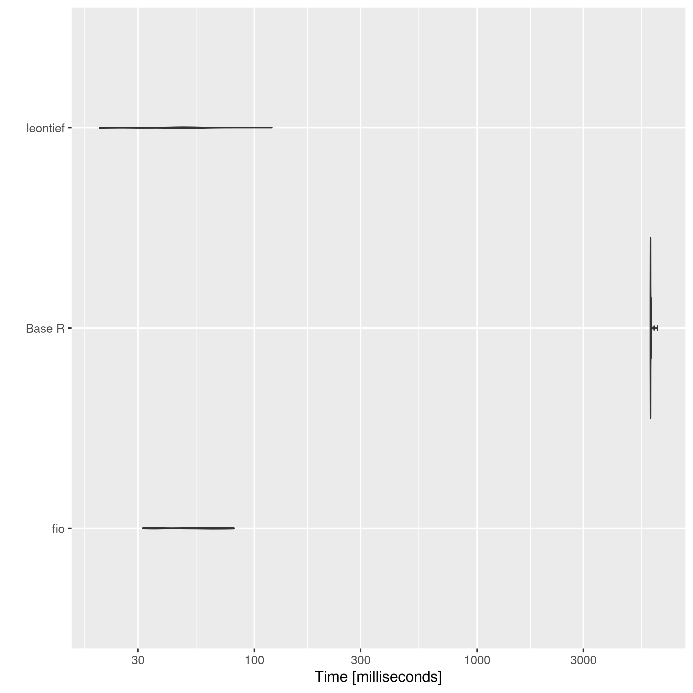
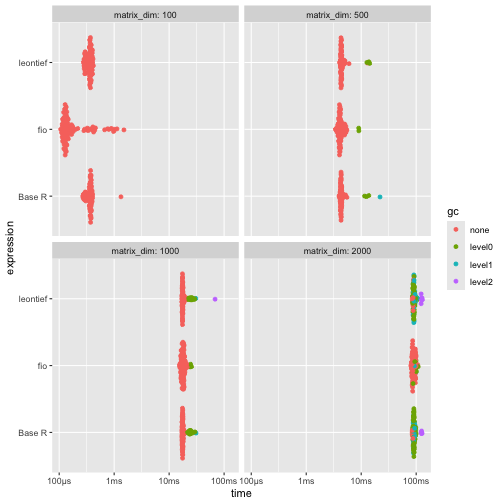
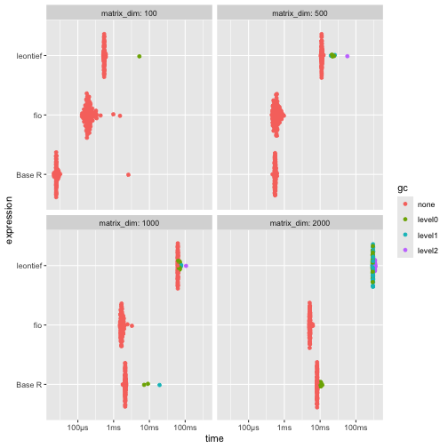
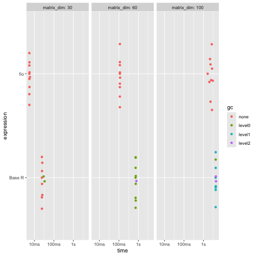

<style>
p.caption {
  font-size: 0.6em;
  text-align: "center";
}


# Introduction

This vignette presents a benchmarking analysis comparing the performance of functions from the `fio` package with equivalent base R functions. The `fio` package provides a set of functions for input-output analysis, a method used in economics to analyze the interdependencies between different sectors of an economy.

In this document, we will focus on two key functions: the technical coefficients matrix calculation and the Leontief inverse matrix calculation. These functions are fundamental to input-output analysis, and their performance can significantly impact the speed of larger analyses.

Our benchmarking tests, which involve running these functions repeatedely in simulated datasets, show that the `fio` package functions are faster than the equivalent base R functions. This improved performance can make a substantial difference in larger analyses, making the `fio` package a valuable tool for input-output analysis in R.

The tests were run on a simulated $2000 \times 2000$ matrix, and each test was repeated 100 times to account for variability. Please note that the results of this benchmarking analysis are dependent on the specific test datasets used and the hardware on which the algorithms were run. Therefore, the results should be interpreted in the context of these specific conditions.

## Technical coefficients matrix

The technical coefficients matrix calculation, a key and initial step in input-output analysis, was tested using the `compute_tech_coeff()` function from the `{fio}` package, equivalent functions from the `{leontief}` package, and a base R implementation. It consists on dividing each $a_{ij}$ element of intermediate transactions matrix by the correspondent $x_j$ element of total production vector^[Or in a equivalent way, multiplying intermediate transactions matrix by a diagonal matrix constructed from total production vector.]. The results show that both `{fio}` and `{leontief}` functions execute almost instantaneously, with `{fio}` slightly faster (about 5 milliseconds apart). In contrast, the base R implementation is about 150 times slower than `{fio}`.


```r
# set seed
set.seed(100)

# data
matrix_dim <- 2000
intermediate_transactions <- matrix(
  as.double(sample(1:1000, matrix_dim^2, replace = TRUE)),
  nrow = matrix_dim,
  ncol = matrix_dim
)
total_production <- matrix(
  as.double(sample(4000000:6000000, matrix_dim, replace = TRUE)),
  nrow = 1,
  ncol = matrix_dim
)

# Base R function
tech_coeff_r <- function(intermediate_transactions, total_production) {
  tech_coeff_matrix <- intermediate_transactions %*% diag(1 / as.vector(total_production))
  return(tech_coeff_matrix)
}

# {fio} setup
iom_fio <- fio::iom$new("iom", intermediate_transactions, total_production)

# benchmark
benchmark_a <- microbenchmark::microbenchmark(
  fio = fio:::compute_tech_coeff(intermediate_transactions, total_production),
  `Base R` = tech_coeff_r(intermediate_transactions, total_production),
  leontief = leontief::input_requirement(intermediate_transactions, total_production),
  times = 100
)
print(benchmark_a)
#> Unit: milliseconds
#>      expr        min         lq       mean     median         uq         max neval
#>       fio   32.24106   38.22049   42.28276   40.77030   42.92088    90.20673   100
#>    Base R 7116.86712 7136.63368 7553.85911 7152.95092 7336.31015 11166.83317   100
#>  leontief   41.04016   44.61389   50.98095   48.07349   53.46332   107.02680   100

# plot
ggplot2::autoplot(benchmark_a)
```

<div class="figure" style="text-align: center">

<p class="caption">\label{fig:benchmark_a}Base R is about 100 times slower than {fio} and {leontief} functions.</p>
</div>

## Leontief inverse matrix

When we're talking about inverting a $2000 \times 2000$ there's a lot more work involved. Leontief matrix ($B$) is obtained from subtracting the technical coefficients matrix ($A$) from the identity matrix ($I$), therefore it has no null rows or columns. 

$$B = I - A$$

It allows for solving the linear system through LU decomposition, which is a more efficient method than the direct inverse matrix calculation. `{fio}` takes advantage of LU decomposition and becomes incredibly faster, while `{leontief}` is over 10 times slower, followed closed by the over 20 times slower base R implementation. 


```r
# data
iom_fio$compute_tech_coeff()
technical_coefficients_matrix <- iom_fio$technical_coefficients_matrix

# base R function
leontief_inverse_r <- function(technical_coefficients_matrix) {
  dim <- nrow(technical_coefficients_matrix)
  leontief_inverse_matrix <- solve(diag(dim) - technical_coefficients_matrix)
  return(leontief_inverse_matrix)
}

# benchmark
benchmark_b <- microbenchmark::microbenchmark(
  fio = fio:::compute_leontief_inverse(technical_coefficients_matrix),
  `Base R` = leontief_inverse_r(technical_coefficients_matrix),
  leontief = leontief::leontief_inverse(technical_coefficients_matrix),
  times = 100
)
print(benchmark_b)
#> Unit: milliseconds
#>      expr       min        lq      mean    median        uq        max neval
#>       fio  336.4356  359.0604  425.3856  369.3041  439.1001   887.2124   100
#>    Base R 5974.8137 6417.0423 7177.0537 6740.9307 7434.9085 11547.6926   100
#>  leontief 5276.7533 5684.3753 6467.1024 5979.7183 7139.3473  9922.3665   100

# plot
ggplot2::autoplot(benchmark_b)
```

<div class="figure" style="text-align: center">

<p class="caption">\label{fig:figs} {fio} is about 20 times faster than {leontief} and base R functions.</p>
</div>

## Sensitivity of dispersion coefficients of variation

To represent linkage-based functions performance, we compute benchmark for sensitivity of dispersion coefficients of variation. All 3 implementations executes almost instantaneously, with `{fio}` being slightly slower than `{leontief}` and base R functions. 


```r
# data
iom_fio$compute_leontief_inverse()
leontief_inverse_matrix <- iom_fio$leontief_inverse_matrix

# base R function
sensitivity_r <- function(B) {
  n <- nrow(B)
  SL = rowSums(B)
  ML = SL / n
  (((1 / (n - 1)) * (colSums((B - ML) ** 2))) ** 0.5) / ML
}

# benchmark
benchmark_c <- microbenchmark::microbenchmark(
  fio = fio:::compute_sensitivity_dispersion_cv(leontief_inverse_matrix),
  `Base R` = sensitivity_r(leontief_inverse_matrix),
  leontief = leontief::sensitivity_dispersion_cv(leontief_inverse_matrix),
  times = 100
)
print(benchmark_c)
#> Unit: milliseconds
#>      expr      min       lq     mean   median       uq      max neval
#>       fio 30.32855 31.01540 32.90370 32.44143 33.50784 40.18426   100
#>    Base R 26.28076 28.08561 31.80958 30.99112 33.87897 47.11353   100
#>  leontief 21.92668 22.27473 25.30608 23.00760 28.76792 35.92875   100
ggplot2::autoplot(benchmark_c)
```

<div class="figure" style="text-align: center">

<p class="caption">\label{fig:benchmark_c} {fio} is about 15 milliseconds slower than {leontief} and 2 milliseconds slower than base R functions.</p>
</div>

# Field of influence

Since field of influence involves computing Leontief inverse matrix for each element of technical coefficients matrix after an increment, it can be demanding for high dimensional matrices. Here, we evaluate benchmark for base R function and {fio}, since there's no similiar function in {leontief}. For brevity, we cut dimensions to 100 and repetitions to 10.


```r
# data
matrix_dim <- 100
intermediate_transactions <- matrix(
  as.double(sample(1:1000, matrix_dim^2, replace = TRUE)),
  nrow = matrix_dim,
  ncol = matrix_dim
)
total_production <- matrix(
  as.double(sample(4000000:6000000, matrix_dim, replace = TRUE)),
  nrow = 1,
  ncol = matrix_dim
)
iom_fio_reduced <- fio::iom$new(
  "iom_reduced",
  intermediate_transactions,
  total_production
)$compute_tech_coeff()$compute_leontief_inverse()

# base R function
field_influence_r <- function(A, B, ee = 0.001) {
  n = nrow(A)
  I = diag(n)
  E = matrix(0, ncol = n, nrow = n)
  SI = matrix(0, ncol = n, nrow = n)
  for (i in 1:n) {
    for (j in 1:n) {
      E[i, j] = ee
      AE = A + E
      BE = solve(I - AE)
      FE = (BE - B) / ee
      FEq = FE * FE
      S = sum(FEq)
      SI[i, j] = S
      E[i, j] = 0
    }
  }
}

# benchmark
benchmark_d <- microbenchmark::microbenchmark(
  fio = fio:::compute_field_influence(
    iom_fio_reduced$technical_coefficients_matrix,
    iom_fio_reduced$leontief_inverse_matrix,
    0.001
  ),
  `Base R` = field_influence_r(iom_fio_reduced$technical_coefficients_matrix, iom_fio_reduced$leontief_inverse_matrix),
  times = 10
)
print(benchmark_d)
#> Unit: seconds
#>    expr      min        lq      mean    median        uq       max neval
#>     fio 3.347394  3.642878  3.722057  3.750987  3.840492  4.155258    10
#>  Base R 9.961029 10.220498 10.760557 10.750220 11.168054 12.060539    10
ggplot2::autoplot(benchmark_d)
```

<div class="figure" style="text-align: center">

<p class="caption">\label{fig:benchmark_d} {fio} is the best option for input-output analysis when matrix inversion is needed.</p>
</div>
