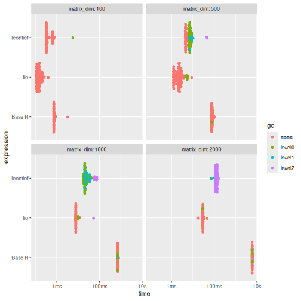
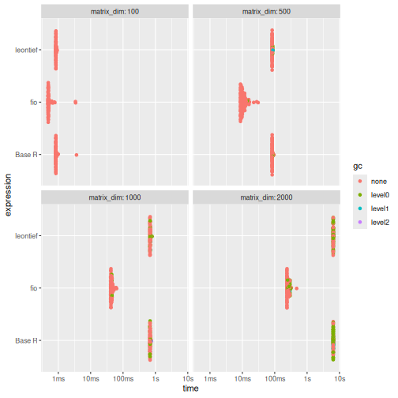
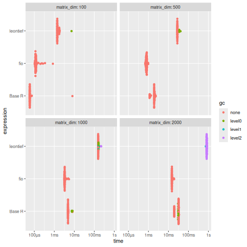
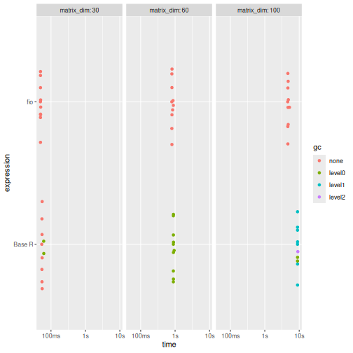

<!-- This is a precomputing script. To run it, `knitr::knit("vignettes/articles/benchmarking_i5_orig.Rmd.orig", output = "vignettes/articles/benchmarking_i5.Rmd")` -->

<style>
p.caption {
  font-size: 0.6em;
  text-align: "center";
}
</style>


# DISCLAIMER

The present benchmark was conducted on 2025-06-17 on a Intel® Core™ i5-7400 (4-core CPU, AMD Radeon™ RX 580 2048SP GPU, 16GB RAM, Ubuntu 24.04). Results _will_ vary depending on the hardware. These benchmarks aim to provide a general idea of the performance differences between the `fio` package and other implementations but should not be considered definitive. The performance of the functions may also vary depending on the specific data used and the context in which they are applied.

# Introduction

This vignette presents a benchmarking analysis comparing the performance of functions from the `fio` package with equivalent base R functions and functions from other packages. The `fio` package provides a set of functions for input-output analysis, a method used in economics to analyze the interdependencies between different sectors of an economy.

Our benchmarking tests show that `fio` package functions are either faster or more memory-efficient than other implementations. This improved performance can make a substantial difference in larger analyses, making the `fio` package a valuable tool for input-output analysis in R.

The tests were run on simulated square matrices, with dimensions ranging from 100x100 up to 2000x2000, and each test was repeated at least 10 times to account for variability. Please note that the results of this benchmarking analysis depend on the specific test datasets used and the hardware on which the algorithms were run. Therefore, the results should be interpreted in the context of these specific conditions.

# Technical coefficients matrix

The technical coefficients matrix calculation, a key and initial step in input-output analysis, was tested using the `compute_tech_coeff()` function from the `{fio}` package, equivalent functions from the `{leontief}` package, and a base R implementation. It consists of dividing each $a_{ij}$ element of the intermediate transactions matrix by the corresponding $x_j$ element of the total production vector^[Or equivalently, multiplying the intermediate transactions matrix by a diagonal matrix constructed from the total production vector.].

Results shows that {fio} is generally faster and uses significantly less memory than the other two implementations, especially for larger matrices (≥500x500). The memory usage of {fio} is approximately half that of Base R and 12% of that used by {leontief}.


``` r
# set seed
set.seed(100)

# Base R function
tech_coeff_r <- function(intermediate_transactions, total_production) {
  tech_coeff_matrix <- intermediate_transactions %*% diag(1 / as.vector(total_production))
  return(tech_coeff_matrix)
}

# benchmark
benchmark_a <- bench::press(
  matrix_dim = c(100, 500, 1000, 2000),
  {
    intermediate_transactions <- matrix(
      as.double(sample(1:1000, matrix_dim^2, replace = TRUE)),
      nrow = matrix_dim,
      ncol = matrix_dim
    )
    total_production <- matrix(
      as.double(sample(4000000:6000000, matrix_dim, replace = TRUE)),
      nrow = 1,
      ncol = matrix_dim
    )
    iom_fio <- fio::iom$new("iom", intermediate_transactions, total_production)
    bench::mark(
      fio = fio:::compute_tech_coeff(intermediate_transactions, total_production),
      `Base R` = tech_coeff_r(intermediate_transactions, total_production),
      leontief = leontief::input_requirement(intermediate_transactions, total_production),
      iterations = 100
    )
  }
)
#> Running with:
#>   matrix_dim
#> 1        100
#> 2        500
#> 3       1000
#> 4       2000
#> Warning: Some expressions had a GC in every iteration; so filtering is disabled.
print(benchmark_a)
#> # A tibble: 12 × 14
#>    expression matrix_dim      min   median `itr/sec` mem_alloc  `gc/sec` n_itr  n_gc total_time result            memory     time       gc      
#>    <bch:expr>      <dbl> <bch:tm> <bch:tm>     <dbl> <bch:byt>     <dbl> <int> <dbl>   <bch:tm> <list>            <list>     <list>     <list>  
#>  1 fio               100 108.97µs 148.26µs  6494.     861.82KB    0        100     0     15.4ms <dbl [100 × 100]> <Rprofmem> <bench_tm> <tibble>
#>  2 Base R            100 722.76µs 730.42µs  1293.     190.67KB    0        100     0    77.31ms <dbl [100 × 100]> <Rprofmem> <bench_tm> <tibble>
#>  3 leontief          100 311.21µs 325.95µs  2360.     724.27KB   23.8       99     1    41.95ms <dbl [100 × 100]> <Rprofmem> <bench_tm> <tibble>
#>  4 fio               500   1.22ms   2.16ms   448.       1.91MB   23.6       95     5   211.83ms <dbl [500 × 500]> <Rprofmem> <bench_tm> <tibble>
#>  5 Base R            500  75.66ms   79.4ms    12.4      3.82MB    1.38      90    10      7.25s <dbl [500 × 500]> <Rprofmem> <bench_tm> <tibble>
#>  6 leontief          500   4.37ms   4.63ms   209.      16.29MB  354.        39    66   186.45ms <dbl [500 × 500]> <Rprofmem> <bench_tm> <tibble>
#>  7 fio              1000   7.65ms   7.81ms   127.       7.63MB   19.0       87    13   685.64ms <dbl[…]>          <Rprofmem> <bench_tm> <tibble>
#>  8 Base R           1000  718.2ms 726.26ms     1.37    15.27MB    0.708     66    34        48s <dbl[…]>          <Rprofmem> <bench_tm> <tibble>
#>  9 leontief         1000  35.74ms  35.84ms    27.9        65MB 2121.         2   152    71.68ms <dbl[…]>          <Rprofmem> <bench_tm> <tibble>
#> 10 fio              2000  18.03ms  29.62ms    33.7     30.52MB    5.39     100    16      2.97s <dbl[…]>          <Rprofmem> <bench_tm> <tibble>
#> 11 Base R           2000    6.01s    6.04s     0.166   61.05MB    0.0613   100    37     10.06m <dbl[…]>          <Rprofmem> <bench_tm> <tibble>
#> 12 leontief         2000  71.69ms 125.73ms     7.95    259.7MB   21.6      100   272     12.58s <dbl[…]>          <Rprofmem> <bench_tm> <tibble>

# plot
ggplot2::autoplot(benchmark_a)
```

<div class="figure" style="text-align: center">

<p class="caption">\label{fig:benchmark_a} For larger matrices (≥500x500), {fio} is generally faster and uses significantly less memory: approximately half that of Base R and 12% of that used by {leontief}.</p>
</div>

# Leontief inverse matrix

The Leontief matrix ($L$) is obtained by subtracting the technical coefficients matrix ($A$) from the identity matrix ($I$); therefore, it has no null rows or columns. This allows for solving the linear system $L \times L^{-1} = I$ through LU decomposition, which is a more efficient method than direct inverse matrix calculation.

Results shows that execution times are comparable across methods, with {fio} demonstrating superior memory efficiency, using less than half the memory of alternatives.


``` r
# base R function
leontief_inverse_r <- function(technical_coefficients_matrix) {
  dim <- nrow(technical_coefficients_matrix)
  leontief_inverse_matrix <- solve(diag(dim) - technical_coefficients_matrix)
  return(leontief_inverse_matrix)
}

# benchmark
benchmark_b <- bench::press(
  matrix_dim = c(100, 500, 1000, 2000),
  {
    intermediate_transactions <- matrix(
      as.double(sample(1:1000, matrix_dim^2, replace = TRUE)),
      nrow = matrix_dim,
      ncol = matrix_dim
    )
    total_production <- matrix(
      as.double(sample(4000000:6000000, matrix_dim, replace = TRUE)),
      nrow = 1,
      ncol = matrix_dim
    )
    iom_fio <- fio::iom$new("iom", intermediate_transactions, total_production)
    iom_fio$compute_tech_coeff()
    technical_coefficients_matrix <- iom_fio$technical_coefficients_matrix
    bench::mark(
      fio = fio:::compute_leontief_inverse(technical_coefficients_matrix),
      `Base R` = leontief_inverse_r(technical_coefficients_matrix),
      leontief = leontief::leontief_inverse(technical_coefficients_matrix),
      iterations = 100,
      check = FALSE
    )
  }
)
#> Running with:
#>   matrix_dim
#> 1        100
#> 2        500
#> 3       1000
#> 4       2000
print(benchmark_b)
#> # A tibble: 12 × 14
#>    expression matrix_dim      min   median `itr/sec` mem_alloc `gc/sec` n_itr  n_gc total_time result memory              time       gc      
#>    <bch:expr>      <dbl> <bch:tm> <bch:tm>     <dbl> <bch:byt>    <dbl> <int> <dbl>   <bch:tm> <list> <list>              <list>     <list>  
#>  1 fio               100 476.68µs 492.41µs  1772.     158.51KB    0       100     0    56.45ms <NULL> <Rprofmem [6 × 3]>  <bench_tm> <tibble>
#>  2 Base R            100 834.58µs 843.59µs  1137.     413.29KB    0       100     0    87.94ms <NULL> <Rprofmem [20 × 3]> <bench_tm> <tibble>
#>  3 leontief          100 837.19µs 846.39µs  1174.     402.57KB    0       100     0    85.19ms <NULL> <Rprofmem [15 × 3]> <bench_tm> <tibble>
#>  4 fio               500   8.57ms   9.93ms    91.6      3.81MB    0.925    99     1      1.08s <NULL> <Rprofmem [2 × 3]>  <bench_tm> <tibble>
#>  5 Base R            500  82.82ms  83.51ms    11.9      9.55MB    1.03     92     8      7.74s <NULL> <Rprofmem [7 × 3]>  <bench_tm> <tibble>
#>  6 leontief          500  82.91ms  83.29ms    12.0      9.55MB    1.18     91     9       7.6s <NULL> <Rprofmem [7 × 3]>  <bench_tm> <tibble>
#>  7 fio              1000  41.35ms  43.24ms    22.5     15.26MB    1.69     93     7      4.14s <NULL> <Rprofmem [2 × 3]>  <bench_tm> <tibble>
#>  8 Base R           1000 669.08ms 681.85ms     1.46    38.18MB    0.389    79    21     53.94s <NULL> <Rprofmem [7 × 3]>  <bench_tm> <tibble>
#>  9 leontief         1000  672.2ms 682.89ms     1.46    38.18MB    0.412    78    22     53.43s <NULL> <Rprofmem [7 × 3]>  <bench_tm> <tibble>
#> 10 fio              2000 236.29ms 247.58ms     3.91    61.03MB    1.04     79    21     20.21s <NULL> <Rprofmem [2 × 3]>  <bench_tm> <tibble>
#> 11 Base R           2000     6.4s    6.41s     0.156  152.66MB    0.467    26    78      2.78m <NULL> <Rprofmem [7 × 3]>  <bench_tm> <tibble>
#> 12 leontief         2000    6.39s     6.4s     0.156  152.66MB    0.156    50    50      5.34m <NULL> <Rprofmem [7 × 3]>  <bench_tm> <tibble>

# plot
ggplot2::autoplot(benchmark_b)
```

<div class="figure" style="text-align: center">

<p class="caption">\label{fig:benchmark_b} While execution times are comparable across methods, {fio} demonstrates superior memory efficiency, using less than half the memory of alternatives for matrices 500x500 and larger.</p>
</div>

# Sensitivity of dispersion coefficients of variation

To evaluate the performance of linkage-based functions, we benchmarked the sensitivity of dispersion coefficients of variation.

Results shows that {fio} is substantially faster and more memory-efficient than {leontief} across all tested dimensions. Compared to Base R, {fio} is faster for matrices 1000x1000 and larger, while memory usage remains comparable.


``` r
# base R function
sensitivity_r <- function(B) {
  n <- nrow(B)
  SL = rowSums(B)
  ML = SL / n
  (((1 / (n - 1)) * (colSums((B - ML) ** 2))) ** 0.5) / ML
}

# benchmark
benchmark_c <- bench::press(
  matrix_dim = c(100, 500, 1000, 2000),
  {
    intermediate_transactions <- matrix(
      as.double(sample(1:1000, matrix_dim^2, replace = TRUE)),
      nrow = matrix_dim,
      ncol = matrix_dim
    )
    total_production <- matrix(
      as.double(sample(4000000:6000000, matrix_dim, replace = TRUE)),
      nrow = 1,
      ncol = matrix_dim
    )
    iom_fio <- fio::iom$new("iom", intermediate_transactions, total_production)
    iom_fio$compute_tech_coeff()$compute_leontief_inverse()
    leontief_inverse_matrix <- iom_fio$leontief_inverse_matrix
    bench::mark(
      fio = fio:::compute_sensitivity_dispersion_cv(leontief_inverse_matrix),
      `Base R` = sensitivity_r(leontief_inverse_matrix),
      leontief = leontief::sensitivity_dispersion_cv(leontief_inverse_matrix),
      iterations = 100,
      check = FALSE
    )
  }
)
#> Running with:
#>   matrix_dim
#> 1        100
#> 2        500
#> 3       1000
#> 4       2000
#> Warning: Some expressions had a GC in every iteration; so filtering is disabled.
print(benchmark_c)
#> # A tibble: 12 × 14
#>    expression matrix_dim      min   median `itr/sec` mem_alloc `gc/sec` n_itr  n_gc total_time result memory                  time       gc      
#>    <bch:expr>      <dbl> <bch:tm> <bch:tm>     <dbl> <bch:byt>    <dbl> <int> <dbl>   <bch:tm> <list> <list>                  <list>     <list>  
#>  1 fio               100  104.9µs 117.43µs   7615.     81.23KB     0      100     0    13.13ms <NULL> <Rprofmem [6 × 3]>      <bench_tm> <tibble>
#>  2 Base R            100  59.04µs  59.95µs   7116.     81.48KB     0      100     0    14.05ms <NULL> <Rprofmem [5 × 3]>      <bench_tm> <tibble>
#>  3 leontief          100   1.39ms   1.42ms    667.    745.38KB     6.74    99     1   148.37ms <NULL> <Rprofmem [522 × 3]>    <bench_tm> <tibble>
#>  4 fio               500 695.04µs 797.88µs   1251.      1.91MB     0      100     0    79.91ms <NULL> <Rprofmem [2 × 3]>      <bench_tm> <tibble>
#>  5 Base R            500   1.14ms   1.95ms    552.      1.92MB     0      100     0      181ms <NULL> <Rprofmem [5 × 3]>      <bench_tm> <tibble>
#>  6 leontief          500  27.78ms  28.01ms     35.3    17.31MB     2.66    93     7      2.63s <NULL> <Rprofmem [2,513 × 3]>  <bench_tm> <tibble>
#>  7 fio              1000   3.11ms    3.3ms    298.      7.64MB     0      100     0   335.86ms <NULL> <Rprofmem [2 × 3]>      <bench_tm> <tibble>
#>  8 Base R           1000   4.82ms   4.87ms    201.      7.66MB     8.37    96     4   477.94ms <NULL> <Rprofmem [5 × 3]>      <bench_tm> <tibble>
#>  9 leontief         1000 155.33ms 156.15ms      6.39   68.94MB     3.29    66    34     10.33s <NULL> <Rprofmem [5,013 × 3]>  <bench_tm> <tibble>
#> 10 fio              2000  14.83ms  15.02ms     65.9    30.53MB     0      100     0      1.52s <NULL> <Rprofmem [2 × 3]>      <bench_tm> <tibble>
#> 11 Base R           2000  19.37ms  32.08ms     35.2    30.58MB     4.23   100    12      2.84s <NULL> <Rprofmem [5 × 3]>      <bench_tm> <tibble>
#> 12 leontief         2000 744.88ms 822.07ms      1.21  275.22MB     3.35   100   276      1.37m <NULL> <Rprofmem [10,013 × 3]> <bench_tm> <tibble>
ggplot2::autoplot(benchmark_c)
```

<div class="figure" style="text-align: center">

<p class="caption">\label{fig:benchmark_c} {fio} is substantially faster and more memory-efficient than {leontief} across all tested dimensions. Compared to Base R, {fio} is faster for matrices 1000x1000 and larger, while memory usage remains comparable.</p>
</div>

# Field of influence

Since computing the field of influence involves calculating the Leontief inverse matrix for each element of the technical coefficients matrix after an increment, it can be demanding for high-dimensional matrices. Here, we benchmark the base R function and `{fio}`, as there is no similar function in `{leontief}`. For brevity, we limited the matrix dimensions to 100x100 and the number of repetitions to 10.

Results shows that {fio} is almost two times faster than the base R implementation and uses significantly less memory. For the 100x100 matrix, {fio} used 156.34KB, while the base R implementation used 5.25GB, which would lead to memory issues for larger matrices and would make it impractical for real-world applications, specially in personal computers with limited memory.


``` r
# base R function
field_influence_r <- function(A, B, ee = 0.001) {
  n = nrow(A)
  I = diag(n)
  E = matrix(0, ncol = n, nrow = n)
  SI = matrix(0, ncol = n, nrow = n)
  for (i in 1:n) {
    for (j in 1:n) {
      E[i, j] = ee
      AE = A + E
      BE = solve(I - AE)
      FE = (BE - B) / ee
      FEq = FE * FE
      S = sum(FEq)
      SI[i, j] = S
      E[i, j] = 0
    }
  }
  return(SI) # Added return statement
}

# benchmark
benchmark_d <- bench::press(
  matrix_dim = c(30, 60, 100),
  {
    intermediate_transactions <- matrix(
      as.double(sample(1:1000, matrix_dim^2, replace = TRUE)),
      nrow = matrix_dim,
      ncol = matrix_dim
    )
    total_production <- matrix(
      as.double(sample(4000000:6000000, matrix_dim, replace = TRUE)),
      nrow = 1,
      ncol = matrix_dim
    )
    iom_fio_reduced <- fio::iom$new(
      "iom_reduced",
      intermediate_transactions,
      total_production
    )$compute_tech_coeff()$compute_leontief_inverse()
    bench::mark(
      fio = fio:::compute_field_influence(
        iom_fio_reduced$technical_coefficients_matrix,
        iom_fio_reduced$leontief_inverse_matrix,
        0.001
      ),
      `Base R` = field_influence_r(
        iom_fio_reduced$technical_coefficients_matrix,
        iom_fio_reduced$leontief_inverse_matrix
      ),
      iterations = 10,
      check = FALSE
    )
  }
)
#> Running with:
#>   matrix_dim
#> 1         30
#> 2         60
#> Warning: Some expressions had a GC in every iteration; so filtering is disabled.
#> 3        100
#> Warning: Some expressions had a GC in every iteration; so filtering is disabled.
print(benchmark_d)
#> # A tibble: 6 × 14
#>   expression matrix_dim      min   median `itr/sec` mem_alloc `gc/sec` n_itr  n_gc total_time result memory                  time       gc      
#>   <bch:expr>      <dbl> <bch:tm> <bch:tm>     <dbl> <bch:byt>    <dbl> <int> <dbl>   <bch:tm> <list> <list>                  <list>     <list>  
#> 1 fio                30   49.3ms  49.59ms    20.1     16.66KB     0       10     0   496.66ms <NULL> <Rprofmem [6 × 3]>      <bench_tm> <tibble>
#> 2 Base R             30  53.92ms  54.84ms    18.2     44.52MB     4.56     8     2   438.77ms <NULL> <Rprofmem [7,383 × 3]>  <bench_tm> <tibble>
#> 3 fio                60 802.29ms 809.86ms     1.21    56.34KB     0       10     0      8.26s <NULL> <Rprofmem [2 × 3]>      <bench_tm> <tibble>
#> 4 Base R             60 890.07ms  893.2ms     1.11    701.2MB     2.23    10    20      8.98s <NULL> <Rprofmem [32,403 × 3]> <bench_tm> <tibble>
#> 5 fio               100    4.64s    4.71s     0.210  156.34KB     0       10     0     47.72s <NULL> <Rprofmem [2 × 3]>      <bench_tm> <tibble>
#> 6 Base R            100    8.93s    8.95s     0.111    5.25GB     1.95    10   175       1.5m <NULL> <Rprofmem [90,003 × 3]> <bench_tm> <tibble>
ggplot2::autoplot(benchmark_d)
```

<div class="figure" style="text-align: center">

<p class="caption">\label{fig:benchmark_d} Across all matrix sizes, {fio} demonstrates superior performance, being considerably faster and more memory-efficient than the Base R implementation.</p>
</div>
