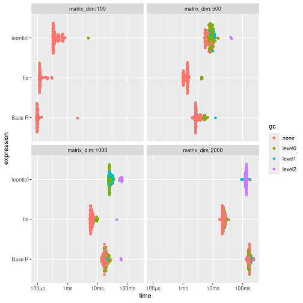
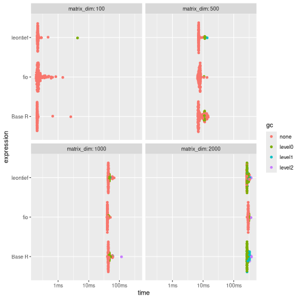
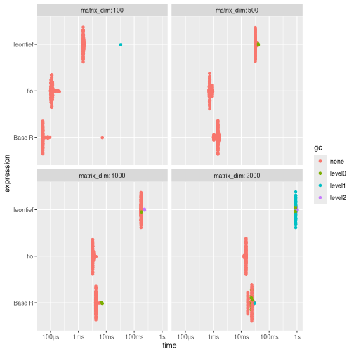
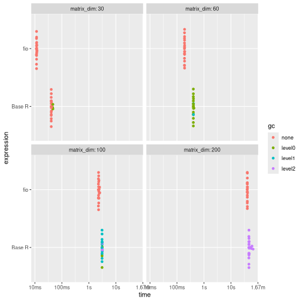

<!-- This is a precomputing script. To run it, `knitr::knit("vignettes/articles/benchmarking_i7_orig.Rmd.orig", output = "vignettes/articles/benchmarking_i7.Rmd")` -->

<style>
p.caption {
  font-size: 0.6em;
  text-align: "center";
}
</style>


# DISCLAIMER

The present benchmark was conducted on 2025-06-17 on a Intel® Core™ i7-10510U (8-core CPU, Intel® UHD Graphics (CML GT2) GPU, 16GB RAM, Fedora 42). Results _will_ vary depending on the hardware. These benchmarks aim to provide a general idea of the performance differences between the `fio` package and other implementations but should not be considered definitive. The performance of the functions may also vary depending on the specific data used and the context in which they are applied.

# Introduction

This vignette presents a benchmarking analysis comparing the performance of functions from the `fio` package with equivalent base R functions and functions from other packages. The `fio` package provides a set of functions for input-output analysis, a method used in economics to analyze the interdependencies between different sectors of an economy.

Our benchmarking tests show that `fio` package functions are either faster or more memory-efficient than other implementations. This improved performance can make a substantial difference in larger analyses, making the `fio` package a valuable tool for input-output analysis in R.

The tests were run on simulated square matrices, with dimensions ranging from 100x100 up to 2000x2000, and each test was repeated at least 20 times to account for variability. Please note that the results of this benchmarking analysis depend on the specific test datasets used and the hardware on which the algorithms were run. Therefore, the results should be interpreted in the context of these specific conditions.

# Technical coefficients matrix

The technical coefficients matrix calculation, a key and initial step in input-output analysis, was tested using the `compute_tech_coeff()` function from the `{fio}` package, equivalent functions from the `{leontief}` package, and a base R implementation. It consists of dividing each $a_{ij}$ element of the intermediate transactions matrix by the corresponding $x_j$ element of the total production vector^[Or equivalently, multiplying the intermediate transactions matrix by a diagonal matrix constructed from the total production vector.].

Results shows that {fio} is generally faster and uses significantly less memory than the other two implementations, especially for larger matrices (≥500x500). The memory usage of {fio} is approximately half that of Base R and 12% of that used by {leontief}.


``` r
# set seed
set.seed(100)

# Base R function
tech_coeff_r <- function(intermediate_transactions, total_production) {
  tech_coeff_matrix <- intermediate_transactions %*% diag(1 / as.vector(total_production))
  return(tech_coeff_matrix)
}

# benchmark
benchmark_a <- bench::press(
  matrix_dim = c(100, 500, 1000, 2000),
  {
    intermediate_transactions <- matrix(
      as.double(sample(1:1000, matrix_dim^2, replace = TRUE)),
      nrow = matrix_dim,
      ncol = matrix_dim
    )
    total_production <- matrix(
      as.double(sample(4000000:6000000, matrix_dim, replace = TRUE)),
      nrow = 1,
      ncol = matrix_dim
    )
    iom_fio <- fio::iom$new("iom", intermediate_transactions, total_production)
    bench::mark(
      fio = fio:::compute_tech_coeff(intermediate_transactions, total_production),
      `Base R` = tech_coeff_r(intermediate_transactions, total_production),
      leontief = leontief::input_requirement(intermediate_transactions, total_production),
      iterations = 100
    )
  }
)
#> Running with:
#>   matrix_dim
#> 1        100
#> 2        500
#> 3       1000
#> 4       2000
#> Warning: Some expressions had a GC in every iteration; so filtering is disabled.
print(benchmark_a)
#> # A tibble: 12 × 9
#>    expression matrix_dim      min   median mem_alloc `gc/sec` n_itr  n_gc total_time
#>    <bch:expr>      <dbl> <bch:tm> <bch:tm> <bch:byt>    <dbl> <int> <dbl>   <bch:tm>
#>  1 fio               100 112.56µs 118.83µs  861.82KB     0      100     0    12.73ms
#>  2 Base R            100  91.71µs     98µs  190.67KB     0      100     0    11.96ms
#>  3 leontief          100 320.35µs 353.71µs  724.27KB    23.5     99     1    42.61ms
#>  4 fio               500 985.86µs    1.4ms    1.91MB    40.6     95     5   123.16ms
#>  5 Base R            500   2.05ms    2.7ms    3.82MB    35.9     90    10   278.89ms
#>  6 leontief          500   5.26ms   6.13ms   16.29MB   241.      39    66   274.29ms
#>  7 fio              1000   5.59ms   6.31ms    7.63MB    23.2     87    13   560.16ms
#>  8 Base R           1000  13.75ms  17.73ms   15.27MB    28.4     66    34       1.2s
#>  9 leontief         1000  32.03ms  32.21ms      65MB  2359.       2   152    64.43ms
#> 10 fio              2000  16.91ms  23.11ms   30.52MB     6.83   100    16      2.34s
#> 11 Base R           2000 132.31ms 168.71ms   61.05MB     2.17   100    37     17.05s
#> 12 leontief         2000  91.15ms 132.83ms   259.7MB    20.8    100   272     13.11s

# plot
ggplot2::autoplot(benchmark_a)
```

<div class="figure" style="text-align: center">

<p class="caption">\label{fig:benchmark_a} For larger matrices (≥500x500), {fio} is generally faster and uses significantly less memory: approximately half that of Base R and 12% of that used by {leontief}.</p>
</div>

# Leontief inverse matrix

The Leontief matrix ($L$) is obtained by subtracting the technical coefficients matrix ($A$) from the identity matrix ($I$); therefore, it has no null rows or columns. This allows for solving the linear system $L \times L^{-1} = I$ through LU decomposition, which is a more efficient method than direct inverse matrix calculation.

Results shows that for larger matrices, `{fio}` is slightly slower than the alternatives, but demonstrates superior memory efficiency, using less than half the memory.


``` r
# base R function
leontief_inverse_r <- function(technical_coefficients_matrix) {
  dim <- nrow(technical_coefficients_matrix)
  leontief_inverse_matrix <- solve(diag(dim) - technical_coefficients_matrix)
  return(leontief_inverse_matrix)
}

# benchmark
benchmark_b <- bench::press(
  matrix_dim = c(100, 500, 1000, 2000),
  {
    intermediate_transactions <- matrix(
      as.double(sample(1:1000, matrix_dim^2, replace = TRUE)),
      nrow = matrix_dim,
      ncol = matrix_dim
    )
    total_production <- matrix(
      as.double(sample(4000000:6000000, matrix_dim, replace = TRUE)),
      nrow = 1,
      ncol = matrix_dim
    )
    iom_fio <- fio::iom$new("iom", intermediate_transactions, total_production)
    iom_fio$compute_tech_coeff()
    technical_coefficients_matrix <- iom_fio$technical_coefficients_matrix
    bench::mark(
      fio = fio:::compute_leontief_inverse(technical_coefficients_matrix),
      `Base R` = leontief_inverse_r(technical_coefficients_matrix),
      leontief = leontief::leontief_inverse(technical_coefficients_matrix),
      iterations = 100,
      check = FALSE
    )
  }
)
#> Running with:
#>   matrix_dim
#> 1        100
#> 2        500
#> 3       1000
#> 4       2000
#> Warning: Some expressions had a GC in every iteration; so filtering is disabled.
print(benchmark_b)
#> # A tibble: 12 × 9
#>    expression matrix_dim      min   median mem_alloc `gc/sec` n_itr  n_gc total_time
#>    <bch:expr>      <dbl> <bch:tm> <bch:tm> <bch:byt>    <dbl> <int> <dbl>   <bch:tm>
#>  1 fio               100 191.88µs 226.28µs  158.49KB    0       100     0    27.26ms
#>  2 Base R            100 203.29µs 207.36µs  413.29KB    0       100     0    23.69ms
#>  3 leontief          100 207.99µs 216.64µs  402.57KB   45.6      99     1    21.94ms
#>  4 fio               500   6.61ms   7.67ms    3.81MB    1.31     99     1   765.07ms
#>  5 Base R            500   6.75ms   7.27ms    9.55MB    9.89     92     8   808.97ms
#>  6 leontief          500   7.16ms    7.2ms    9.55MB   13.5      91     9   664.83ms
#>  7 fio              1000  39.35ms  40.58ms   15.26MB    2.12     92     8      3.77s
#>  8 Base R           1000  40.98ms  43.47ms   38.18MB    5.24     81    19      3.63s
#>  9 leontief         1000  42.15ms   43.5ms   38.18MB    5.89     79    21      3.56s
#> 10 fio              2000 272.45ms 297.67ms   61.03MB    0.633   100    19     30.01s
#> 11 Base R           2000 268.28ms 274.25ms  152.66MB    3.64    100   105     28.86s
#> 12 leontief         2000 265.02ms 273.16ms  152.66MB    2.57    100    74     28.76s

# plot
ggplot2::autoplot(benchmark_b)
```

<div class="figure" style="text-align: center">

<p class="caption">\label{fig:benchmark_b} While `{fio}` is slightly slower for larger matrices, it demonstrates superior memory efficiency, using less than half the memory of alternatives.</p>
</div>

# Sensitivity of dispersion coefficients of variation

To evaluate the performance of linkage-based functions, we benchmarked the sensitivity of dispersion coefficients of variation.

Results shows that {fio} is substantially faster and more memory-efficient than {leontief} across all tested dimensions. Compared to Base R, {fio} is faster for matrices 1000x1000 and larger, while memory usage remains comparable.


``` r
# base R function
sensitivity_r <- function(B) {
  n <- nrow(B)
  SL = rowSums(B)
  ML = SL / n
  (((1 / (n - 1)) * (colSums((B - ML) ** 2))) ** 0.5) / ML
}

# benchmark
benchmark_c <- bench::press(
  matrix_dim = c(100, 500, 1000, 2000),
  {
    intermediate_transactions <- matrix(
      as.double(sample(1:1000, matrix_dim^2, replace = TRUE)),
      nrow = matrix_dim,
      ncol = matrix_dim
    )
    total_production <- matrix(
      as.double(sample(4000000:6000000, matrix_dim, replace = TRUE)),
      nrow = 1,
      ncol = matrix_dim
    )
    iom_fio <- fio::iom$new("iom", intermediate_transactions, total_production)
    iom_fio$compute_tech_coeff()$compute_leontief_inverse()
    leontief_inverse_matrix <- iom_fio$leontief_inverse_matrix
    bench::mark(
      fio = fio:::compute_sensitivity_dispersion_cv(leontief_inverse_matrix),
      `Base R` = sensitivity_r(leontief_inverse_matrix),
      leontief = leontief::sensitivity_dispersion_cv(leontief_inverse_matrix),
      iterations = 100,
      check = FALSE
    )
  }
)
#> Running with:
#>   matrix_dim
#> 1        100
#> 2        500
#> 3       1000
#> 4       2000
print(benchmark_c)
#> # A tibble: 12 × 9
#>    expression matrix_dim      min   median mem_alloc `gc/sec` n_itr  n_gc total_time
#>    <bch:expr>      <dbl> <bch:tm> <bch:tm> <bch:byt>    <dbl> <int> <dbl>   <bch:tm>
#>  1 fio               100  98.81µs 111.06µs   81.21KB     0      100     0    11.48ms
#>  2 Base R            100  52.02µs  53.11µs   81.48KB     0      100     0    12.66ms
#>  3 leontief          100   1.46ms   1.49ms  745.38KB     6.69    99     1   149.52ms
#>  4 fio               500 692.57µs 745.83µs    1.91MB     0      100     0    76.71ms
#>  5 Base R            500      1ms   1.47ms    1.92MB     0      100     0   140.15ms
#>  6 leontief          500  31.64ms  31.98ms   17.31MB     1.28    96     4      3.13s
#>  7 fio              1000   3.15ms   3.27ms    7.64MB     0      100     0   331.91ms
#>  8 Base R           1000   4.09ms   4.26ms    7.66MB     4.75    98     2   421.33ms
#>  9 leontief         1000 173.77ms 175.64ms   68.94MB     1.17    83    17     14.59s
#> 10 fio              2000  12.66ms  14.83ms   30.53MB     0      100     0      1.45s
#> 11 Base R           2000  17.17ms  23.86ms   30.58MB     7.53    86    14      1.86s
#> 12 leontief         2000 861.23ms    865ms  275.22MB    19.5      9   152      7.79s

# plot
ggplot2::autoplot(benchmark_c)
```

<div class="figure" style="text-align: center">

<p class="caption">\label{fig:benchmark_c} {fio} is substantially faster and more memory-efficient than {leontief} across all tested dimensions. Compared to Base R, {fio} is faster for matrices 1000x1000 and larger, while memory usage remains comparable.</p>
</div>

# Field of influence

Since computing the field of influence involves calculating the Leontief inverse matrix for each element of the technical coefficients matrix after an increment, it can be demanding for high-dimensional matrices. Here, we benchmark the base R function and `{fio}`, as there is no similar function in `{leontief}`. For brevity, we limited the matrix dimensions to 100x100 and the number of repetitions to 10.

Results shows that {fio} is faster than the base R implementation and uses vastly less memory. For the 200x200 matrix, {fio} used 625KB, while the base R implementation used 83.73GB. This enormous difference in memory consumption makes the Base R version impractical for larger matrices on most machines.


``` r
# base R function
field_influence_r <- function(A, B, ee = 0.001) {
  n = nrow(A)
  I = diag(n)
  E = matrix(0, ncol = n, nrow = n)
  SI = matrix(0, ncol = n, nrow = n)
  for (i in 1:n) {
    for (j in 1:n) {
      E[i, j] = ee
      AE = A + E
      BE = solve(I - AE)
      FE = (BE - B) / ee
      FEq = FE * FE
      S = sum(FEq)
      SI[i, j] = S
      E[i, j] = 0
    }
  }
  return(SI) # Added return statement
}

# benchmark
benchmark_d <- bench::press(
  matrix_dim = c(30, 60, 100, 200),
  {
    intermediate_transactions <- matrix(
      as.double(sample(1:1000, matrix_dim^2, replace = TRUE)),
      nrow = matrix_dim,
      ncol = matrix_dim
    )
    total_production <- matrix(
      as.double(sample(4000000:6000000, matrix_dim, replace = TRUE)),
      nrow = 1,
      ncol = matrix_dim
    )
    iom_fio_reduced <- fio::iom$new(
      "iom_reduced",
      intermediate_transactions,
      total_production
    )$compute_tech_coeff()$compute_leontief_inverse()
    bench::mark(
      fio = fio:::compute_field_influence(
        iom_fio_reduced$technical_coefficients_matrix,
        iom_fio_reduced$leontief_inverse_matrix,
        0.001
      ),
      `Base R` = field_influence_r(
        iom_fio_reduced$technical_coefficients_matrix,
        iom_fio_reduced$leontief_inverse_matrix
      ),
      iterations = 20,
      check = FALSE
    )
  }
)
#> Running with:
#>   matrix_dim
#> 1         30
#> 2         60
#> Warning: Some expressions had a GC in every iteration; so filtering is disabled.
#> 3        100
#> Warning: Some expressions had a GC in every iteration; so filtering is disabled.
#> 4        200
#> Warning: Some expressions had a GC in every iteration; so filtering is disabled.
print(benchmark_d)
#> # A tibble: 8 × 9
#>   expression matrix_dim      min   median mem_alloc `gc/sec` n_itr  n_gc total_time
#>   <bch:expr>      <dbl> <bch:tm> <bch:tm> <bch:byt>    <dbl> <int> <dbl>   <bch:tm>
#> 1 fio                30  11.32ms  11.55ms   16.66KB     0       20     0   231.88ms
#> 2 Base R             30  40.07ms   40.5ms   44.52MB     4.34    17     3   690.66ms
#> 3 fio                60 189.83ms 190.81ms   56.34KB     0       20     0      3.82s
#> 4 Base R             60 403.25ms  404.8ms   701.2MB     5.04    20    41      8.13s
#> 5 fio               100    2.24s    2.31s  156.34KB     0       20     0      46.6s
#> 6 Base R            100    3.04s    3.08s    5.25GB     5.62    20   348      1.03m
#> 7 fio               200   39.98s   40.43s  625.09KB     0       20     0     13.49m
#> 8 Base R            200   46.14s    46.6s   83.73GB     9.23    20  9050     16.35m
ggplot2::autoplot(benchmark_d)
```

<div class="figure" style="text-align: center">

<p class="caption">\label{fig:benchmark_d} {fio} is faster and vastly more memory-efficient than the Base R implementation, whose memory usage makes it impractical for larger matrices.</p>
</div>
