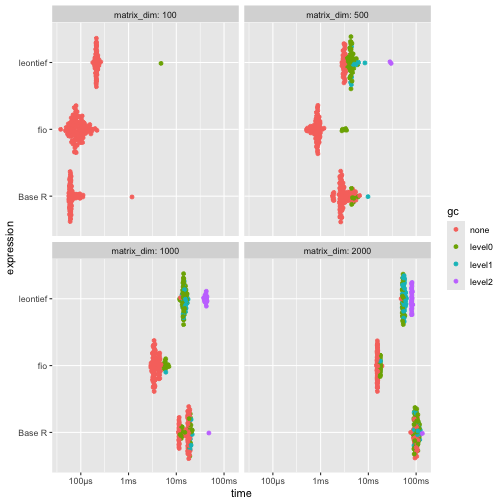
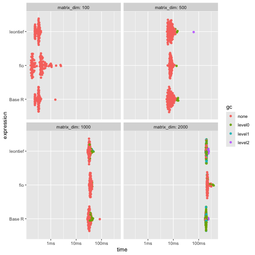
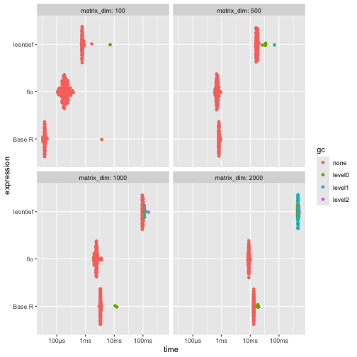
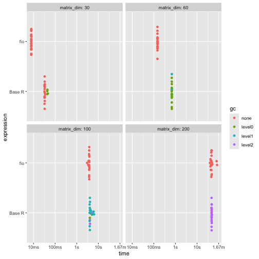

<!-- This is a precomputing script. To run it, `knitr::knit("vignettes/articles/benchmarking_m1_orig.Rmd.orig", output = "vignettes/articles/benchmarking_m1.Rmd")` -->

<style>
p.caption {
  font-size: 0.6em;
  text-align: "center";
}
</style>


# DISCLAIMER

The present benchmark was conducted on 2025-06-17 on a Macbook Air M1 (8-core CPU, 7-core GPU, 8GB RAM). Results _will_ vary depending on the hardware. These benchmarks aim to provide a general idea of the performance differences between the `fio` package and other implementations but should not be considered definitive. The performance of the functions may also vary depending on the specific data used and the context in which they are applied.

# Introduction

This vignette presents a benchmarking analysis comparing the performance of functions from the `fio` package with equivalent base R functions and functions from other packages. The `fio` package provides a set of functions for input-output analysis, a method used in economics to analyze the interdependencies between different sectors of an economy.

Our benchmarking tests show that `fio` package functions are either faster or more memory-efficient than other implementations. This improved performance can make a substantial difference in larger analyses, making the `fio` package a valuable tool for input-output analysis in R.

The tests were run on simulated square matrices, with dimensions ranging from 100x100 up to 2000x2000, and each test was repeated at least 50 times to account for variability. Please note that the results of this benchmarking analysis depend on the specific test datasets used and the hardware on which the algorithms were run. Therefore, the results should be interpreted in the context of these specific conditions.

# Technical coefficients matrix

The technical coefficients matrix calculation, a key and initial step in input-output analysis, was tested using the `compute_tech_coeff()` function from the `{fio}` package, equivalent functions from the `{leontief}` package, and a base R implementation. It consists of dividing each $a_{ij}$ element of the intermediate transactions matrix by the corresponding $x_j$ element of the total production vector^[Or equivalently, multiplying the intermediate transactions matrix by a diagonal matrix constructed from the total production vector.].

Results shows that {fio} is generally faster and uses significantly less memory than the other two implementations, especially for larger matrices (≥500x500). The memory usage of {fio} is approximately half that of Base R and 12% of that used by {leontief}.


``` r
# set seed
set.seed(100)

# Base R function
tech_coeff_r <- function(intermediate_transactions, total_production) {
  tech_coeff_matrix <- intermediate_transactions %*% diag(1 / as.vector(total_production))
  return(tech_coeff_matrix)
}

# benchmark
benchmark_a <- bench::press(
  matrix_dim = c(100, 500, 1000, 2000),
  {
    intermediate_transactions <- matrix(
      as.double(sample(1:1000, matrix_dim^2, replace = TRUE)),
      nrow = matrix_dim,
      ncol = matrix_dim
    )
    total_production <- matrix(
      as.double(sample(4000000:6000000, matrix_dim, replace = TRUE)),
      nrow = 1,
      ncol = matrix_dim
    )
    iom_fio <- fio::iom$new("iom", intermediate_transactions, total_production)
    bench::mark(
      fio = fio:::compute_tech_coeff(intermediate_transactions, total_production),
      `Base R` = tech_coeff_r(intermediate_transactions, total_production),
      leontief = leontief::input_requirement(intermediate_transactions, total_production),
      iterations = 100
    )
  }
)
#> Running with:
#>   matrix_dim
#> 1        100
#> 2        500
#> 3       1000
#> 4       2000
print(benchmark_a)
#> # A tibble: 12 × 14
#>    expression matrix_dim      min   median `itr/sec` mem_alloc `gc/sec` n_itr  n_gc total_time result                memory     time       gc      
#>    <bch:expr>      <dbl> <bch:tm> <bch:tm>     <dbl> <bch:byt>    <dbl> <int> <dbl>   <bch:tm> <list>                <list>     <list>     <list>  
#>  1 fio               100  37.88µs  80.81µs   11044.   861.83KB      0     100     0     9.05ms <dbl [100 × 100]>     <Rprofmem> <bench_tm> <tibble>
#>  2 Base R            100  55.97µs  61.34µs   13051.   190.65KB      0     100     0     7.66ms <dbl [100 × 100]>     <Rprofmem> <bench_tm> <tibble>
#>  3 leontief          100 178.15µs 211.85µs    4683.   706.38KB     47.3    99     1    21.14ms <dbl [100 × 100]>     <Rprofmem> <bench_tm> <tibble>
#>  4 fio               500  509.3µs 858.87µs    1201.     1.91MB     63.2    95     5    79.12ms <dbl [500 × 500]>     <Rprofmem> <bench_tm> <tibble>
#>  5 Base R            500   1.76ms   2.78ms     320.     3.82MB     35.5    90    10   281.61ms <dbl [500 × 500]>     <Rprofmem> <bench_tm> <tibble>
#>  6 leontief          500   2.79ms   3.11ms     321.    16.29MB    566.     38    67   118.47ms <dbl [500 × 500]>     <Rprofmem> <bench_tm> <tibble>
#>  7 fio              1000   2.92ms   3.52ms     270.     7.63MB     43.9    86    14   318.96ms <dbl [1,000 × 1,000]> <Rprofmem> <bench_tm> <tibble>
#>  8 Base R           1000  11.04ms  17.42ms      63.3   15.27MB     34.1    65    35      1.03s <dbl [1,000 × 1,000]> <Rprofmem> <bench_tm> <tibble>
#>  9 leontief         1000  12.27ms  12.27ms      81.5      65MB  12149.      1   149    12.27ms <dbl [1,000 × 1,000]> <Rprofmem> <bench_tm> <tibble>
#> 10 fio              2000  14.68ms  15.46ms      64.5   30.52MB     31.7    67    33      1.04s <dbl [2,000 × 2,000]> <Rprofmem> <bench_tm> <tibble>
#> 11 Base R           2000  76.97ms  98.06ms      10.3   61.05MB     21.8    32    68      3.12s <dbl [2,000 × 2,000]> <Rprofmem> <bench_tm> <tibble>
#> 12 leontief         2000  48.61ms  48.61ms      20.6   259.7MB   4073.      1   198    48.61ms <dbl [2,000 × 2,000]> <Rprofmem> <bench_tm> <tibble>

# plot
ggplot2::autoplot(benchmark_a)
```

<div class="figure" style="text-align: center">

<p class="caption">\label{fig:benchmark_a} For larger matrices (≥500x500), {fio} is generally faster and uses significantly less memory: approximately half that of Base R and 12% of that used by {leontief}.</p>
</div>

# Leontief inverse matrix

The Leontief matrix ($L$) is obtained by subtracting the technical coefficients matrix ($A$) from the identity matrix ($I$); therefore, it has no null rows or columns. This allows for solving the linear system $L \times L^{-1} = I$ through LU decomposition, which is a more efficient method than direct inverse matrix calculation.

Results shows that while {fio} is slightly slower, it demonstrates superior memory efficiency, using less than half the memory of alternatives.


``` r
# base R function
leontief_inverse_r <- function(technical_coefficients_matrix) {
  dim <- nrow(technical_coefficients_matrix)
  leontief_inverse_matrix <- solve(diag(dim) - technical_coefficients_matrix)
  return(leontief_inverse_matrix)
}

# benchmark
benchmark_b <- bench::press(
  matrix_dim = c(100, 500, 1000, 2000),
  {
    intermediate_transactions <- matrix(
      as.double(sample(1:1000, matrix_dim^2, replace = TRUE)),
      nrow = matrix_dim,
      ncol = matrix_dim
    )
    total_production <- matrix(
      as.double(sample(4000000:6000000, matrix_dim, replace = TRUE)),
      nrow = 1,
      ncol = matrix_dim
    )
    iom_fio <- fio::iom$new("iom", intermediate_transactions, total_production)
    iom_fio$compute_tech_coeff()
    technical_coefficients_matrix <- iom_fio$technical_coefficients_matrix
    bench::mark(
      fio = fio:::compute_leontief_inverse(technical_coefficients_matrix),
      `Base R` = leontief_inverse_r(technical_coefficients_matrix),
      leontief = leontief::leontief_inverse(technical_coefficients_matrix),
      iterations = 100,
      check = FALSE
    )
  }
)
#> Running with:
#>   matrix_dim
#> 1        100
#> 2        500
#> 3       1000
#> 4       2000
print(benchmark_b)
#> # A tibble: 12 × 14
#>    expression matrix_dim      min   median `itr/sec` mem_alloc `gc/sec` n_itr  n_gc total_time result memory              time             gc      
#>    <bch:expr>      <dbl> <bch:tm> <bch:tm>     <dbl> <bch:byt>    <dbl> <int> <dbl>   <bch:tm> <list> <list>              <list>           <list>  
#>  1 fio               100 161.58µs 392.45µs   2362.    158.51KB    0       100     0    42.34ms <NULL> <Rprofmem [6 × 3]>  <bench_tm [100]> <tibble>
#>  2 Base R            100 233.74µs  327.9µs   3044.    413.27KB    0       100     0    32.85ms <NULL> <Rprofmem [20 × 3]> <bench_tm [100]> <tibble>
#>  3 leontief          100  233.5µs 327.26µs   3212.    402.57KB    0       100     0    31.14ms <NULL> <Rprofmem [15 × 3]> <bench_tm [100]> <tibble>
#>  4 fio               500   5.97ms   7.81ms    126.      3.81MB    1.27     99     1    788.2ms <NULL> <Rprofmem [2 × 3]>  <bench_tm [100]> <tibble>
#>  5 Base R            500   5.46ms   7.28ms    128.      9.55MB    6.76     95     5   740.03ms <NULL> <Rprofmem [7 × 3]>  <bench_tm [100]> <tibble>
#>  6 leontief          500   5.63ms   7.68ms    128.      9.55MB    5.32     96     4   752.23ms <NULL> <Rprofmem [7 × 3]>  <bench_tm [100]> <tibble>
#>  7 fio              1000  32.09ms  36.49ms     27.2    15.26MB    0.555    98     2       3.6s <NULL> <Rprofmem [2 × 3]>  <bench_tm [100]> <tibble>
#>  8 Base R           1000  27.86ms  32.78ms     29.8    38.18MB    6.11     83    17      2.78s <NULL> <Rprofmem [7 × 3]>  <bench_tm [100]> <tibble>
#>  9 leontief         1000  28.52ms   32.6ms     30.3    38.18MB    6.65     82    18      2.71s <NULL> <Rprofmem [7 × 3]>  <bench_tm [100]> <tibble>
#> 10 fio              2000 207.78ms 219.31ms      4.41   61.03MB    0.903    83    17     18.83s <NULL> <Rprofmem [2 × 3]>  <bench_tm [100]> <tibble>
#> 11 Base R           2000 181.47ms 189.29ms      5.25  152.66MB   45.3      11    95       2.1s <NULL> <Rprofmem [7 × 3]>  <bench_tm [100]> <tibble>
#> 12 leontief         2000  188.4ms 195.59ms      5.07  152.66MB   28.6      17    96      3.35s <NULL> <Rprofmem [7 × 3]>  <bench_tm [100]> <tibble>

# plot
ggplot2::autoplot(benchmark_b)
```

<div class="figure" style="text-align: center">

<p class="caption">\label{fig:benchmark_b} While slightly slower, {fio} demonstrates superior memory efficiency, using less than half the memory of alternatives for matrices 500x500 and larger.</p>
</div>

# Sensitivity of dispersion coefficients of variation

To evaluate the performance of linkage-based functions, we benchmarked the sensitivity of dispersion coefficients of variation.

Results shows that {fio} is substantially faster and more memory-efficient than {leontief} across all tested dimensions. Compared to Base R, {fio} is faster for matrices 500x500 and larger, while memory usage remains comparable.


``` r
# base R function
sensitivity_r <- function(B) {
  n <- nrow(B)
  SL = rowSums(B)
  ML = SL / n
  (((1 / (n - 1)) * (colSums((B - ML) ** 2))) ** 0.5) / ML
}

# benchmark
benchmark_c <- bench::press(
  matrix_dim = c(100, 500, 1000, 2000),
  {
    intermediate_transactions <- matrix(
      as.double(sample(1:1000, matrix_dim^2, replace = TRUE)),
      nrow = matrix_dim,
      ncol = matrix_dim
    )
    total_production <- matrix(
      as.double(sample(4000000:6000000, matrix_dim, replace = TRUE)),
      nrow = 1,
      ncol = matrix_dim
    )
    iom_fio <- fio::iom$new("iom", intermediate_transactions, total_production)
    iom_fio$compute_tech_coeff()$compute_leontief_inverse()
    leontief_inverse_matrix <- iom_fio$leontief_inverse_matrix
    bench::mark(
      fio = fio:::compute_sensitivity_dispersion_cv(leontief_inverse_matrix),
      `Base R` = sensitivity_r(leontief_inverse_matrix),
      leontief = leontief::sensitivity_dispersion_cv(leontief_inverse_matrix),
      iterations = 100,
      check = FALSE
    )
  }
)
#> Running with:
#>   matrix_dim
#> 1        100
#> 2        500
#> 3       1000
#> 4       2000
print(benchmark_c)
#> # A tibble: 12 × 14
#>    expression matrix_dim      min   median `itr/sec` mem_alloc `gc/sec` n_itr  n_gc total_time result memory                  time             gc      
#>    <bch:expr>      <dbl> <bch:tm> <bch:tm>     <dbl> <bch:byt>    <dbl> <int> <dbl>   <bch:tm> <list> <list>                  <list>           <list>  
#>  1 fio               100 106.72µs 186.63µs   5070.     81.23KB     0      100     0    19.72ms <NULL> <Rprofmem [6 × 3]>      <bench_tm [100]> <tibble>
#>  2 Base R            100  33.17µs  37.97µs  13509.     81.48KB     0      100     0      7.4ms <NULL> <Rprofmem [5 × 3]>      <bench_tm [100]> <tibble>
#>  3 leontief          100 725.25µs 767.52µs   1266.    745.38KB    12.8     99     1    78.18ms <NULL> <Rprofmem [522 × 3]>    <bench_tm [100]> <tibble>
#>  4 fio               500 580.23µs 700.08µs   1424.      1.91MB     0      100     0    70.24ms <NULL> <Rprofmem [2 × 3]>      <bench_tm [100]> <tibble>
#>  5 Base R            500 796.84µs  811.7µs   1217.      1.92MB     0      100     0    82.18ms <NULL> <Rprofmem [5 × 3]>      <bench_tm [100]> <tibble>
#>  6 leontief          500   15.3ms  16.95ms     58.7    17.31MB     3.09    95     5      1.62s <NULL> <Rprofmem [2,513 × 3]>  <bench_tm [100]> <tibble>
#>  7 fio              1000   1.92ms   2.37ms    423.      7.64MB     0      100     0   236.42ms <NULL> <Rprofmem [2 × 3]>      <bench_tm [100]> <tibble>
#>  8 Base R           1000   2.99ms   3.32ms    300.      7.66MB     6.13    98     2   326.19ms <NULL> <Rprofmem [5 × 3]>      <bench_tm [100]> <tibble>
#>  9 leontief         1000  93.56ms  97.73ms     10.2    68.94MB     2.23    82    18      8.06s <NULL> <Rprofmem [5,013 × 3]>  <bench_tm [100]> <tibble>
#> 10 fio              2000   8.37ms   8.88ms    113.     30.53MB     0      100     0   887.34ms <NULL> <Rprofmem [2 × 3]>      <bench_tm [100]> <tibble>
#> 11 Base R           2000  13.09ms  13.21ms     75.6    30.58MB     7.47    91     9       1.2s <NULL> <Rprofmem [5 × 3]>      <bench_tm [100]> <tibble>
#> 12 leontief         2000 441.81ms 441.81ms      2.26  275.22MB   378.       1   167   441.81ms <NULL> <Rprofmem [10,013 × 3]> <bench_tm [100]> <tibble>

# plot
ggplot2::autoplot(benchmark_c)
```

<div class="figure" style="text-align: center">

<p class="caption">\label{fig:benchmark_c} {fio} is substantially faster and more memory-efficient than {leontief} across all tested dimensions. Compared to Base R, {fio} is faster for matrices 500x500 and larger, while memory usage remains comparable.</p>
</div>

# Field of influence

Since computing the field of influence involves calculating the Leontief inverse matrix for each element of the technical coefficients matrix after an increment, it can be demanding for high-dimensional matrices. Here, we benchmark the base R function and `{fio}`, as there is no similar function in `{leontief}`. For brevity, we limited the matrix dimensions to 200x200 and the number of repetitions to 20.

Results shows that {fio} is considerably faster and uses significantly less memory. For the 100x100 matrix, {fio} used 156.34KB while Base R used 5.25GB, and for the 200x200 matrix, {fio} used 625.09KB while Base R used 83.73GB. This massive memory difference makes the Base R implementation impractical for real-world applications, especially on personal computers with limited memory.


``` r
# base R function
field_influence_r <- function(A, B, ee = 0.001) {
  n = nrow(A)
  I = diag(n)
  E = matrix(0, ncol = n, nrow = n)
  SI = matrix(0, ncol = n, nrow = n)
  for (i in 1:n) {
    for (j in 1:n) {
      E[i, j] = ee
      AE = A + E
      BE = solve(I - AE)
      FE = (BE - B) / ee
      FEq = FE * FE
      S = sum(FEq)
      SI[i, j] = S
      E[i, j] = 0
    }
  }
  return(SI) # Added return statement
}

# benchmark
benchmark_d <- bench::press(
  matrix_dim = c(30, 60, 100, 200),
  {
    intermediate_transactions <- matrix(
      as.double(sample(1:1000, matrix_dim^2, replace = TRUE)),
      nrow = matrix_dim,
      ncol = matrix_dim
    )
    total_production <- matrix(
      as.double(sample(4000000:6000000, matrix_dim, replace = TRUE)),
      nrow = 1,
      ncol = matrix_dim
    )
    iom_fio_reduced <- fio::iom$new(
      "iom_reduced",
      intermediate_transactions,
      total_production
    )$compute_tech_coeff()$compute_leontief_inverse()
    bench::mark(
      fio = fio:::compute_field_influence(
        iom_fio_reduced$technical_coefficients_matrix,
        iom_fio_reduced$leontief_inverse_matrix,
        0.001
      ),
      `Base R` = field_influence_r(
        iom_fio_reduced$technical_coefficients_matrix,
        iom_fio_reduced$leontief_inverse_matrix
      ),
      iterations = 20,
      check = FALSE
    )
  }
)
#> Running with:
#>   matrix_dim
#> 1         30
#> 2         60
#> Warning: Some expressions had a GC in every iteration; so filtering is disabled.
#> 3        100
#> Warning: Some expressions had a GC in every iteration; so filtering is disabled.
#> 4        200
#> Warning: Some expressions had a GC in every iteration; so filtering is disabled.
print(benchmark_d)
#> # A tibble: 8 × 14
#>   expression matrix_dim      min   median `itr/sec` mem_alloc `gc/sec` n_itr  n_gc total_time result memory                   time            gc      
#>   <bch:expr>      <dbl> <bch:tm> <bch:tm>     <dbl> <bch:byt>    <dbl> <int> <dbl>   <bch:tm> <list> <list>                   <list>          <list>  
#> 1 fio                30   7.81ms   7.87ms  127.       16.67KB     0       20     0   157.31ms <NULL> <Rprofmem [6 × 3]>       <bench_tm [20]> <tibble>
#> 2 Base R             30  31.95ms  32.67ms   30.4      44.52MB     7.61    16     4   525.55ms <NULL> <Rprofmem [7,383 × 3]>   <bench_tm [20]> <tibble>
#> 3 fio                60 146.76ms 147.24ms    6.79     56.34KB     0       20     0      2.95s <NULL> <Rprofmem [2 × 3]>       <bench_tm [20]> <tibble>
#> 4 Base R             60 669.46ms 677.64ms    1.48     701.2MB     4.13    20    56     13.55s <NULL> <Rprofmem [32,403 × 3]>  <bench_tm [20]> <tibble>
#> 5 fio               100    3.02s    3.76s    0.270   156.34KB     0       20     0      1.23m <NULL> <Rprofmem [2 × 3]>       <bench_tm [20]> <tibble>
#> 6 Base R            100    3.94s    4.09s    0.222     5.25GB     4.16    20   375       1.5m <NULL> <Rprofmem [90,003 × 3]>  <bench_tm [20]> <tibble>
#> 7 fio               200   39.25s   46.28s    0.0204  625.09KB     0       20     0     16.36m <NULL> <Rprofmem [2 × 3]>       <bench_tm [20]> <tibble>
#> 8 Base R            200   46.52s   47.17s    0.0211   83.73GB     6.92    20  6550     15.77m <NULL> <Rprofmem [360,003 × 3]> <bench_tm [20]> <tibble>
ggplot2::autoplot(benchmark_d)
```

<div class="figure" style="text-align: center">

<p class="caption">\label{fig:benchmark_d} Across all matrix sizes, {fio} demonstrates superior performance, being considerably faster and more memory-efficient than the Base R implementation.</p>
</div>
