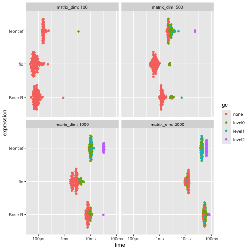
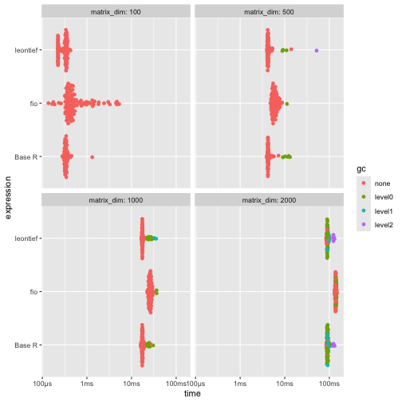
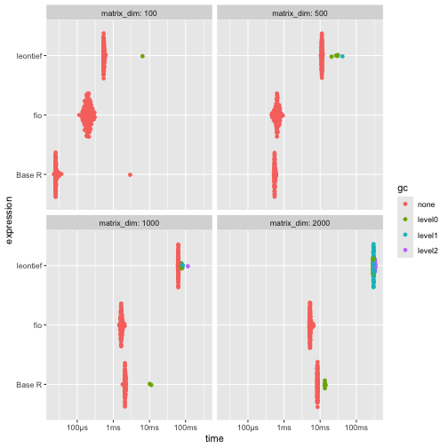
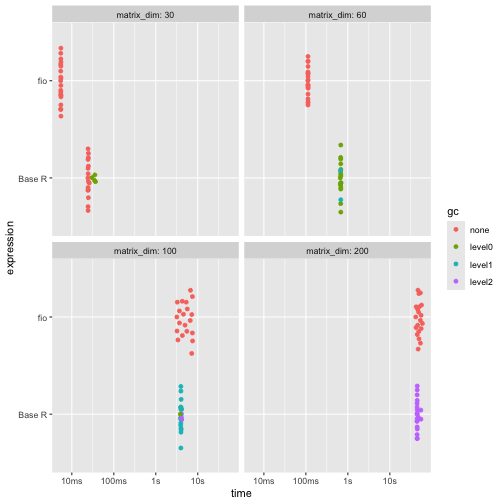

<!-- This is a precomputing script. To run it, `knitr::knit("vignettes/articles/benchmarking_m4_orig.Rmd.orig", output = "vignettes/articles/benchmarking_m4.Rmd")` -->

<style>
p.caption {
  font-size: 0.6em;
  text-align: "center";
}
</style>


# DISCLAIMER

The present benchmark was conducted on 2025-06-17 on a Macbook Pro M4 (12-core CPU, 16-core GPU, 24GB RAM). Results _will_ vary depending on the hardware. These benchmarks aim to provide a general idea of the performance differences between the `fio` package and other implementations but should not be considered definitive. The performance of the functions may also vary depending on the specific data used and the context in which they are applied.

# Introduction

This vignette presents a benchmarking analysis comparing the performance of functions from the `fio` package with equivalent base R functions and functions from other packages. The `fio` package provides a set of functions for input-output analysis, a method used in economics to analyze the interdependencies between different sectors of an economy.

Our benchmarking tests show that `fio` package functions are either faster or more memory-efficient than other implementations. This improved performance can make a substantial difference in larger analyses, making the `fio` package a valuable tool for input-output analysis in R.

The tests were run on simulated square matrices, with dimensions ranging from 100x100 up to 2000x2000, and each test was repeated at least 50 times to account for variability. Please note that the results of this benchmarking analysis depend on the specific test datasets used and the hardware on which the algorithms were run. Therefore, the results should be interpreted in the context of these specific conditions.

# Technical coefficients matrix

The technical coefficients matrix calculation, a key and initial step in input-output analysis, was tested using the `compute_tech_coeff()` function from the `{fio}` package, equivalent functions from the `{leontief}` package, and a base R implementation. It consists of dividing each $a_{ij}$ element of the intermediate transactions matrix by the corresponding $x_j$ element of the total production vector^[Or equivalently, multiplying the intermediate transactions matrix by a diagonal matrix constructed from the total production vector.].

Results shows that {fio} is generally faster and uses significantly less memory than the other two implementations, especially for larger matrices (≥500x500). The memory usage of {fio} is approximately half that of Base R and 12% of that used by {leontief}.


``` r
# set seed
set.seed(100)

# Base R function
tech_coeff_r <- function(intermediate_transactions, total_production) {
  tech_coeff_matrix <- intermediate_transactions %*% diag(1 / as.vector(total_production))
  return(tech_coeff_matrix)
}

# benchmark
benchmark_a <- bench::press(
  matrix_dim = c(100, 500, 1000, 2000),
  {
    intermediate_transactions <- matrix(
      as.double(sample(1:1000, matrix_dim^2, replace = TRUE)),
      nrow = matrix_dim,
      ncol = matrix_dim
    )
    total_production <- matrix(
      as.double(sample(4000000:6000000, matrix_dim, replace = TRUE)),
      nrow = 1,
      ncol = matrix_dim
    )
    iom_fio <- fio::iom$new("iom", intermediate_transactions, total_production)
    bench::mark(
      fio = fio:::compute_tech_coeff(intermediate_transactions, total_production),
      `Base R` = tech_coeff_r(intermediate_transactions, total_production),
      leontief = leontief::input_requirement(intermediate_transactions, total_production),
      iterations = 100
    )
  }
)
#> Running with:
#>   matrix_dim
#> 1        100
#> 2        500
#> 3       1000
#> 4       2000
print(benchmark_a)
#> # A tibble: 10 × 9
#>    expression matrix_dim      min   median mem_alloc `gc/sec` n_itr  n_gc total_time
#>    <bch:expr>      <dbl> <bch:tm> <bch:tm> <bch:byt>    <dbl> <int> <dbl>   <bch:tm>
#>  1 fio               100  48.17µs     72µs  861.83KB      0     100     0     7.95ms
#>  2 Base R            100  52.03µs  82.78µs  190.65KB      0     100     0     9.26ms
#>  3 leontief          100 138.13µs 152.93µs  706.38KB     64.8    99     1    15.43ms
#>  4 fio               500  433.7µs 646.57µs    1.91MB     80.6    95     5    62.04ms
#>  5 Base R            500 941.89µs   1.21ms    3.82MB     86.4    90    10   115.81ms
#>  6 leontief          500   1.84ms   2.13ms   16.29MB    826.     38    67    81.07ms
#>  7 fio              1000   1.73ms   2.67ms    7.63MB     63.9    86    14   219.15ms
#>  8 Base R           1000   6.54ms   7.85ms   15.27MB     67.5    65    35   518.57ms
#>  9 leontief         1000   8.84ms   8.84ms      65MB  16847.      1   149     8.84ms
#> 10 fio              2000   9.02ms  12.94ms   30.52MB     40.5    67    33   815.73ms
#> 11 Base R           2000  46.12ms  51.36ms  61.05MB     41.0    32    68      1.66s
#> 12 leontief         2000  36.67ms  36.67ms  259.7MB   5400.      1   198    36.67ms

# plot
ggplot2::autoplot(benchmark_a)
```

<div class="figure" style="text-align: center">

<p class="caption">\label{fig:benchmark_a} For larger matrices (≥500x500), {fio} is generally faster and uses significantly less memory: approximately half that of Base R and 12% of that used by {leontief}.</p>
</div>

# Leontief inverse matrix

The Leontief matrix ($L$) is obtained by subtracting the technical coefficients matrix ($A$) from the identity matrix ($I$); therefore, it has no null rows or columns. This allows for solving the linear system $L \times L^{-1} = I$ through LU decomposition, which is a more efficient method than direct inverse matrix calculation.

Results shows that while {fio} is slightly slower, it demonstrates superior memory efficiency, using less than half the memory of alternatives.


``` r
# base R function
leontief_inverse_r <- function(technical_coefficients_matrix) {
  dim <- nrow(technical_coefficients_matrix)
  leontief_inverse_matrix <- solve(diag(dim) - technical_coefficients_matrix)
  return(leontief_inverse_matrix)
}

# benchmark
benchmark_b <- bench::press(
  matrix_dim = c(100, 500, 1000, 2000),
  {
    intermediate_transactions <- matrix(
      as.double(sample(1:1000, matrix_dim^2, replace = TRUE)),
      nrow = matrix_dim,
      ncol = matrix_dim
    )
    total_production <- matrix(
      as.double(sample(4000000:6000000, matrix_dim, replace = TRUE)),
      nrow = 1,
      ncol = matrix_dim
    )
    iom_fio <- fio::iom$new("iom", intermediate_transactions, total_production)
    iom_fio$compute_tech_coeff()
    technical_coefficients_matrix <- iom_fio$technical_coefficients_matrix
    bench::mark(
      fio = fio:::compute_leontief_inverse(technical_coefficients_matrix),
      `Base R` = leontief_inverse_r(technical_coefficients_matrix),
      leontief = leontief::leontief_inverse(technical_coefficients_matrix),
      iterations = 100,
      check = FALSE
    )
  }
)
#> Running with:
#>   matrix_dim
#> 1        100
#> 2        500
#> 3       1000
#> 4       2000
print(benchmark_b)
#> # A tibble: 12 × 9
#>    expression matrix_dim      min   median mem_alloc `gc/sec` n_itr  n_gc total_time
#>  1 fio               100 136.65µs 442.43µs  158.51KB    0       100     0    77.88ms
#>  2 Base R            100 279.87µs 336.47µs  413.27KB    0       100     0    34.86ms
#>  3 leontief          100 219.72µs 330.58µs  402.57KB    0       100     0    30.46ms
#>  4 fio               500   4.76ms   5.88ms    3.81MB    1.67     99     1   597.14ms
#>  5 Base R            500   3.93ms   4.22ms    9.55MB   12.2      95     5   411.44ms
#>  6 leontief          500   3.98ms   4.21ms    9.55MB    9.55     96     4   419.01ms
#>  7 fio              1000  22.27ms  26.02ms   15.26MB    0.781    98     2      2.56s
#>  8 Base R           1000  16.08ms  17.46ms   38.18MB   11.6      83    17      1.47s
#>  9 leontief         1000  16.47ms  17.43ms   38.18MB   12.5      82    18      1.44s
#> 10 fio              2000 130.66ms  138.6ms   61.03MB    1.48     83    17     11.51s
#> 11 Base R           2000  85.16ms  88.54ms  152.66MB   97.4      11    95    975.6ms
#> 12 leontief         2000  84.71ms  88.36ms  152.66MB   63.9      17    96       1.5s

# plot
ggplot2::autoplot(benchmark_b)
```

<div class="figure" style="text-align: center">

<p class="caption">\label{fig:benchmark_b} While slightly slower, {fio} demonstrates superior memory efficiency, using less than half the memory of alternatives for matrices 500x500 and larger.</p>
</div>

# Sensitivity of dispersion coefficients of variation

To evaluate the performance of linkage-based functions, we benchmarked the sensitivity of dispersion coefficients of variation.

Results shows that {fio} is substantially faster and more memory-efficient than {leontief} across all tested dimensions. Compared to Base R, {fio} is faster for matrices 1000x1000 and larger, while memory usage remains comparable.


``` r
# base R function
sensitivity_r <- function(B) {
  n <- nrow(B)
  SL = rowSums(B)
  ML = SL / n
  (((1 / (n - 1)) * (colSums((B - ML) ** 2))) ** 0.5) / ML
}

# benchmark
benchmark_c <- bench::press(
  matrix_dim = c(100, 500, 1000, 2000),
  {
    intermediate_transactions <- matrix(
      as.double(sample(1:1000, matrix_dim^2, replace = TRUE)),
      nrow = matrix_dim,
      ncol = matrix_dim
    )
    total_production <- matrix(
      as.double(sample(4000000:6000000, matrix_dim, replace = TRUE)),
      nrow = 1,
      ncol = matrix_dim
    )
    iom_fio <- fio::iom$new("iom", intermediate_transactions, total_production)
    iom_fio$compute_tech_coeff()$compute_leontief_inverse()
    leontief_inverse_matrix <- iom_fio$leontief_inverse_matrix
    bench::mark(
      fio = fio:::compute_sensitivity_dispersion_cv(leontief_inverse_matrix),
      `Base R` = sensitivity_r(leontief_inverse_matrix),
      leontief = leontief::sensitivity_dispersion_cv(leontief_inverse_matrix),
      iterations = 100,
      check = FALSE
    )
  }
)
#> Running with:
#>   matrix_dim
#> 1        100
#> 2        500
#> 3       1000
#> 4       2000
print(benchmark_c)
#> # A tibble: 12 × 9
#>    expression matrix_dim      min   median mem_alloc `gc/sec` n_itr  n_gc total_time
#>  1 fio               100 113.41µs  196.9µs   81.23KB     0      100     0    20.14ms
#>  2 Base R            100  22.67µs  25.62µs   81.48KB     0      100     0     5.52ms
#>  3 leontief          100 528.61µs 543.99µs  745.38KB    18.5     99     1    54.19ms
#>  4 fio               500 451.74µs 639.99µs    1.91MB     0      100     0     64.3ms
#>  5 Base R            500 522.87µs 548.95µs    1.92MB     0      100     0    55.39ms
#>  6 leontief          500  10.35ms  11.09ms   17.31MB     4.74    95     5      1.05s
#>  7 fio              1000   1.47ms   1.66ms    7.64MB     0      100     0   168.68ms
#>  8 Base R           1000    1.8ms   2.11ms    7.66MB     9.64    98     2   207.37ms
#>  9 leontief         1000   61.2ms  62.76ms   68.94MB     3.73    81    19      5.09s
#> 10 fio              2000      5ms   5.26ms   30.53MB     0      100     0   533.11ms
#> 11 Base R           2000   8.25ms   8.41ms   30.58MB    11.8     91     9   765.12ms
#> 12 leontief         2000 290.27ms 290.27ms  275.22MB   575.       1   167   290.27ms

# plot
ggplot2::autoplot(benchmark_c)
```

<div class="figure" style="text-align: center">

<p class="caption">\label{fig:benchmark_c} {fio} is substantially faster and more memory-efficient than {leontief} across all tested dimensions. Compared to Base R, {fio} is faster for matrices 1000x1000 and larger, while memory usage remains comparable.</p>
</div>

# Field of influence

Since computing the field of influence involves calculating the Leontief inverse matrix for each element of the technical coefficients matrix after an increment, it can be demanding for high-dimensional matrices. Here, we benchmark the base R function and `{fio}`, as there is no similar function in `{leontief}`. For brevity, we limited the matrix dimensions to 200x200 and the number of repetitions to 20.

Results shows that {fio} is considerably faster for smaller matrices, but slightly slower for larger ones. However, it uses significantly less memory across all dimensions. For the 200x200 matrix, {fio} used 625.09KB, while the base R implementation used 83.73GB, which would lead to memory issues for larger matrices and would make it impractical for real-world applications, specially in personal computers with limited memory.


``` r
# base R function
field_influence_r <- function(A, B, ee = 0.001) {
  n = nrow(A)
  I = diag(n)
  E = matrix(0, ncol = n, nrow = n)
  SI = matrix(0, ncol = n, nrow = n)
  for (i in 1:n) {
    for (j in 1:n) {
      E[i, j] = ee
      AE = A + E
      BE = solve(I - AE)
      FE = (BE - B) / ee
      FEq = FE * FE
      S = sum(FEq)
      SI[i, j] = S
      E[i, j] = 0
    }
  }
  return(SI) # Added return statement
}

# benchmark
benchmark_d <- bench::press(
  matrix_dim = c(30, 60, 100, 200),
  {
    intermediate_transactions <- matrix(
      as.double(sample(1:1000, matrix_dim^2, replace = TRUE)),
      nrow = matrix_dim,
      ncol = matrix_dim
    )
    total_production <- matrix(
      as.double(sample(4000000:6000000, matrix_dim, replace = TRUE)),
      nrow = 1,
      ncol = matrix_dim
    )
    iom_fio_reduced <- fio::iom$new(
      "iom_reduced",
      intermediate_transactions,
      total_production
    )$compute_tech_coeff()$compute_leontief_inverse()
    bench::mark(
      fio = fio:::compute_field_influence(
        iom_fio_reduced$technical_coefficients_matrix,
        iom_fio_reduced$leontief_inverse_matrix,
        0.001
      ),
      `Base R` = field_influence_r(
        iom_fio_reduced$technical_coefficients_matrix,
        iom_fio_reduced$leontief_inverse_matrix
      ),
      iterations = 20,
      check = FALSE
    )
  }
)
#> Running with:
#>   matrix_dim
#> 1         30
#> 2         60
#> Warning: Some expressions had a GC in every iteration; so filtering is disabled.
#> 3        100
#> Warning: Some expressions had a GC in every iteration; so filtering is disabled.
#> 4        200
#> Warning: Some expressions had a GC in every iteration; so filtering is disabled.
print(benchmark_d)
#> # A tibble: 8 × 9
#>   expression matrix_dim      min   median mem_alloc `gc/sec` n_itr  n_gc total_time
#>   <bch:expr>      <dbl> <bch:tm> <bch:tm> <bch:byt>    <dbl> <int> <dbl>   <bch:tm>
#> 1 fio                30   5.43ms   5.48ms   16.67KB     0       20     0   109.52ms
#> 2 Base R             30   24.1ms  24.48ms   44.52MB    10.2     16     4   393.39ms
#> 3 fio                60 111.31ms 112.34ms   56.34KB     0       20     0      2.25s
#> 4 Base R             60 659.28ms 677.31ms   701.2MB     4.14    20    56     13.53s
#> 5 fio               100    3.18s    5.14s  156.34KB     0       20     0      1.75m
#> 6 Base R            100    3.84s    3.97s    5.25GB     4.71    20   376      1.33m
#> 7 fio               200   41.43s   48.95s  625.09KB     0       20     0     16.52m
#> 8 Base R            200   44.46s   44.85s   83.73GB    11.3     20 10379     15.32m
ggplot2::autoplot(benchmark_d)
```

<div class="figure" style="text-align: center">

<p class="caption">\label{fig:benchmark_d} Across all matrix sizes, {fio} demonstrates superior memory-efficiency. It is also faster for smaller matrices.</p>
</div>
