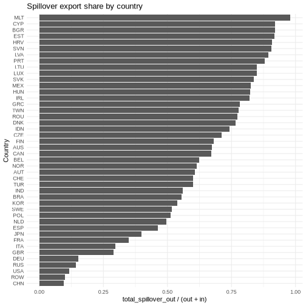

<!-- This is a precomputing script. To run it, `knitr::knit("vignettes/articles/wiod_2014_analysis_orig.Rmd.orig", output = "vignettes/articles/wiod_2014_analysis.Rmd")` -->

<style>
p.caption {
  font-size: 0.6em;
  text-align: "center";
}
</style>


# Introduction

This vignette demonstrates how to use the `fio` package to analyze the World Input-Output Database (WIOD) 2014 (2016 release). We will use `fio` to download the data, parse it, create a Multi-Regional Input-Output Matrix (`miom`) object, and perform various analyses including technical coefficients, Leontief inverse, multipliers, bilateral trade, and spillover effects.

# Data

We download the data from the WIOD website and parse it to create a Multi-Regional Input-Output Matrix (`miom`) object.


``` r
# download wiod 2016 release
fio::download_wiod(year = 2016)
```

This downloads a zip file with the WIOD 2016 release, containing IOTs from 2000 to 2014. We'll use the 2014 IOTs for this analysis.

# Creating the MIOM Object

We parse the `wiot` object to create the `miom` object. Calling `names()` we find that the `wiot` object has the following columns:

- IndustryCode
- IndustryDescription
- Country
- RNr
- Year

Then the intermediate transactions matrix, followed by the final demand matrix.


``` r
# load the data
load("WIOT2014_October16_ROW.RData")

# columns
head(names(wiot), 20)
#>  [1] "IndustryCode"        "IndustryDescription" "Country"             "RNr"                 "Year"                "AUS1"               
#>  [7] "AUS2"                "AUS3"                "AUS4"                "AUS5"                "AUS6"                "AUS7"               
#> [13] "AUS8"                "AUS9"                "AUS10"               "AUS11"               "AUS12"               "AUS13"              
#> [19] "AUS14"               "AUS15"
```

Expanding the `Country` column, we find that it has 45 unique values, corresponding to the 44 countries in the WIOD 2014 release plus a "Total" row. The `IndustryDescription` column has 56 unique values, corresponding to the 56 sectors in the WIOD 2014 release, plus a total row for the intermediate transactions matrix and the Value Added matrix.


``` r
# unique countries
unique(wiot$Country)
#>  [1] "AUS" "AUT" "BEL" "BGR" "BRA" "CAN" "CHE" "CHN" "CYP" "CZE" "DEU" "DNK" "ESP" "EST" "FIN" "FRA" "GBR" "GRC" "HRV" "HUN" "IDN" "IND"
#> [23] "IRL" "ITA" "JPN" "KOR" "LTU" "LUX" "LVA" "MEX" "MLT" "NLD" "NOR" "POL" "PRT" "ROU" "RUS" "SVK" "SVN" "SWE" "TUR" "TWN" "USA" "ROW"
#> [45] "TOT"

# unique sectors
unique(wiot$IndustryDescription)
#>  [1] "Crop and animal production, hunting and related service activities"                                                                                 
#>  [2] "Forestry and logging"                                                                                                                               
#>  [3] "Fishing and aquaculture"                                                                                                                            
#>  [4] "Mining and quarrying"                                                                                                                               
#>  [5] "Manufacture of food products, beverages and tobacco products"                                                                                       
#>  [6] "Manufacture of textiles, wearing apparel and leather products"                                                                                      
#>  [7] "Manufacture of wood and of products of wood and cork, except furniture; manufacture of articles of straw and plaiting materials"                    
#>  [8] "Manufacture of paper and paper products"                                                                                                            
#>  [9] "Printing and reproduction of recorded media"                                                                                                        
#> [10] "Manufacture of coke and refined petroleum products "                                                                                                
#> [11] "Manufacture of chemicals and chemical products "                                                                                                    
#> [12] "Manufacture of basic pharmaceutical products and pharmaceutical preparations"                                                                       
#> [13] "Manufacture of rubber and plastic products"                                                                                                         
#> [14] "Manufacture of other non-metallic mineral products"                                                                                                 
#> [15] "Manufacture of basic metals"                                                                                                                        
#> [16] "Manufacture of fabricated metal products, except machinery and equipment"                                                                           
#> [17] "Manufacture of computer, electronic and optical products"                                                                                           
#> [18] "Manufacture of electrical equipment"                                                                                                                
#> [19] "Manufacture of machinery and equipment n.e.c."                                                                                                      
#> [20] "Manufacture of motor vehicles, trailers and semi-trailers"                                                                                          
#> [21] "Manufacture of other transport equipment"                                                                                                           
#> [22] "Manufacture of furniture; other manufacturing"                                                                                                      
#> [23] "Repair and installation of machinery and equipment"                                                                                                 
#> [24] "Electricity, gas, steam and air conditioning supply"                                                                                                
#> [25] "Water collection, treatment and supply"                                                                                                             
#> [26] "Sewerage; waste collection, treatment and disposal activities; materials recovery; remediation activities and other waste management services "     
#> [27] "Construction"                                                                                                                                       
#> [28] "Wholesale and retail trade and repair of motor vehicles and motorcycles"                                                                            
#> [29] "Wholesale trade, except of motor vehicles and motorcycles"                                                                                          
#> [30] "Retail trade, except of motor vehicles and motorcycles"                                                                                             
#> [31] "Land transport and transport via pipelines"                                                                                                         
#> [32] "Water transport"                                                                                                                                    
#> [33] "Air transport"                                                                                                                                      
#> [34] "Warehousing and support activities for transportation"                                                                                              
#> [35] "Postal and courier activities"                                                                                                                      
#> [36] "Accommodation and food service activities"                                                                                                          
#> [37] "Publishing activities"                                                                                                                              
#> [38] "Motion picture, video and television programme production, sound recording and music publishing activities; programming and broadcasting activities"
#> [39] "Telecommunications"                                                                                                                                 
#> [40] "Computer programming, consultancy and related activities; information service activities"                                                           
#> [41] "Financial service activities, except insurance and pension funding"                                                                                 
#> [42] "Insurance, reinsurance and pension funding, except compulsory social security"                                                                      
#> [43] "Activities auxiliary to financial services and insurance activities"                                                                                
#> [44] "Real estate activities"                                                                                                                             
#> [45] "Legal and accounting activities; activities of head offices; management consultancy activities"                                                     
#> [46] "Architectural and engineering activities; technical testing and analysis"                                                                           
#> [47] "Scientific research and development"                                                                                                                
#> [48] "Advertising and market research"                                                                                                                    
#> [49] "Other professional, scientific and technical activities; veterinary activities"                                                                     
#> [50] "Administrative and support service activities"                                                                                                      
#> [51] "Public administration and defence; compulsory social security"                                                                                      
#> [52] "Education"                                                                                                                                          
#> [53] "Human health and social work activities"                                                                                                            
#> [54] "Other service activities"                                                                                                                           
#> [55] "Activities of households as employers; undifferentiated goods- and services-producing activities of households for own use"                         
#> [56] "Activities of extraterritorial organizations and bodies"                                                                                            
#> [57] "Total intermediate consumption"                                                                                                                     
#> [58] "taxes less subsidies on products"                                                                                                                   
#> [59] "Cif/ fob adjustments on exports"                                                                                                                    
#> [60] "Direct purchases abroad by residents"                                                                                                               
#> [61] "Purchases on the domestic territory by non-residents "                                                                                              
#> [62] "Value added at basic prices"                                                                                                                        
#> [63] "International Transport Margins"                                                                                                                    
#> [64] "Output at basic prices"

# structure
n_countries <- 44
n_sectors <- 56
n_interm <- n_countries * n_sectors

# extract intermediate transactions matrix
Z <- as.matrix(wiot[1:n_interm, 6:(5 + n_interm)])

# total production vector
x <- as.numeric(wiot[1:n_interm, ncol(wiot)])

# fix zeros to avoid division by zero (NaNs in Leontief Inverse)
# since Z columns are 0 where x is 0, setting x=1 results in A=0/1=0, which is correct
x[x == 0] <- 1

x <- matrix(x, nrow = 1)

# extract countries and sectors
countries_long <- as.character(wiot$Country[1:n_interm])
sectors_long <- as.character(wiot$IndustryCode[1:n_interm])

# get unique values respecting order
countries <- unique(countries_long)
sectors <- unique(sectors_long)

# validating dimensions
if (length(countries) != n_countries) stop("Number of extracted countries does not match expected 44.")
if (length(sectors) != n_sectors) stop("Number of extracted sectors does not match expected 56.")

# create miom object
wiod_miom <- fio::miom$new(
  id = "wiod_2014",
  intermediate_transactions = Z,
  total_production = x,
  countries = countries,
  sectors = sectors
)

print(wiod_miom)
#> <miom>
#>   Inherits from: <iom>
#>   Public:
#>     add: function (matrix_name, matrix) 
#>     allocation_coefficients_matrix: NULL
#>     bilateral_trade: NULL
#>     clone: function (deep = FALSE) 
#>     close_model: function (sectors) 
#>     compute_allocation_coeff: function () 
#>     compute_field_influence: function (epsilon) 
#>     compute_ghosh_inverse: function () 
#>     compute_hypothetical_extraction: function (matrix = "ghosh") 
#>     compute_key_sectors: function (matrix = "leontief") 
#>     compute_leontief_inverse: function () 
#>     compute_multiplier_employment: function () 
#>     compute_multiplier_output: function () 
#>     compute_multiplier_taxes: function () 
#>     compute_multiplier_wages: function () 
#>     compute_multiregional_multipliers: function () 
#>     compute_tech_coeff: function () 
#>     countries: AUS AUT BEL BGR BRA CAN CHE CHN CYP CZE DEU DNK ESP EST  ...
#>     domestic_intermediate_transactions: list
#>     exports: NULL
#>     extract_country: function (country) 
#>     field_influence: NULL
#>     final_demand_matrix: NULL
#>     final_demand_others: NULL
#>     get_bilateral_trade: function (origin_country, destination_country) 
#>     get_country_summary: function () 
#>     get_net_spillover_matrix: function () 
#>     get_regional_interdependence: function () 
#>     get_spillover_matrix: function () 
#>     ghosh_inverse_matrix: NULL
#>     government_consumption: NULL
#>     household_consumption: NULL
#>     hypothetical_extraction: NULL
#>     id: wiod_2014
#>     imports: NULL
#>     initialize: function (id, intermediate_transactions, total_production, countries, 
#>     intermediate_transactions: 12924.1796913047 83.0296371764357 19.1477309183893 115.9 ...
#>     international_intermediate_transactions: list
#>     key_sectors: NULL
#>     leontief_inverse_matrix: NULL
#>     multiplier_employment: NULL
#>     multiplier_output: NULL
#>     multiplier_taxes: NULL
#>     multiplier_wages: NULL
#>     multiregional_multipliers: NULL
#>     n_countries: 44
#>     n_sectors: 56
#>     occupation: NULL
#>     operating_income: NULL
#>     remove: function (matrix_name) 
#>     sectors: A01 A02 A03 B C10-C12 C13-C15 C16 C17 C18 C19 C20 C21 C2 ...
#>     set_max_threads: function (max_threads) 
#>     taxes: NULL
#>     technical_coefficients_matrix: NULL
#>     total_production: 70292.0344922962 2585.37968548282 3175.04439635749 17198 ...
#>     update_final_demand_matrix: function () 
#>     update_value_added_matrix: function () 
#>     value_added_matrix: NULL
#>     value_added_others: NULL
#>     wages: NULL
#>   Private:
#>     country_indices: function (country_index) 
#>     decompose_transactions: function () 
#>     ensure_labels: function (intermediate_transactions, total_production) 
#>     iom_elements: function ()
```

# Analysis

## Technical Coefficients

Compute the technical coefficients matrix ($A$).


``` r
wiod_miom$compute_tech_coeff()

# inspect a small corner of the matrix
wiod_miom$technical_coefficients_matrix[1:5, 1:5]
#>           AUS1         AUS2         AUS3         AUS4         AUS5
#> 1 0.1838640720 4.349621e-02 0.0719613440 3.133357e-03 3.010553e-01
#> 2 0.0011812098 7.793824e-02 0.0000602552 9.995446e-05 3.169105e-05
#> 3 0.0002724026 4.173170e-07 0.0060177743 2.458415e-05 3.785148e-03
#> 4 0.0016492601 2.688347e-04 0.0018659508 2.611876e-02 3.971178e-03
#> 5 0.0226318757 3.403999e-04 0.0133984772 1.180404e-03 1.299549e-01
```

## Leontief Inverse

Compute the Leontief inverse matrix ($L = (I-A)^{-1}$).


``` r
wiod_miom$compute_leontief_inverse()

# inspect a small corner of the matrix
wiod_miom$leontief_inverse_matrix[1:5, 1:5]
#>           AUS1         AUS2        AUS3         AUS4        AUS5
#> 1 1.2407423187 5.973791e-02 0.097460580 0.0078478729 0.432622975
#> 2 0.0021694662 1.084703e+00 0.000448754 0.0005569042 0.001053428
#> 3 0.0006396819 8.298081e-05 1.006266345 0.0001902368 0.004765386
#> 4 0.0168505348 5.076858e-02 0.025603805 1.0412554156 0.016683166
#> 5 0.0360356137 3.166686e-03 0.020243954 0.0057830393 1.165478279
```

## Multipliers

Compute multi-regional multipliers.


``` r
wiod_miom$compute_multiregional_multipliers()
multipliers <- wiod_miom$multiregional_multipliers
head(multipliers)
#>   shock_country shock_sector shock_label intra_regional_multiplier spillover_multiplier total_multiplier multiplier_to_AUS
#> 1           AUS          A01     AUS_A01                  1.943062            0.2969466         2.240008          1.943062
#> 2           AUS          A02     AUS_A02                  1.452797            0.4038390         1.856636          1.452797
#> 3           AUS          A03     AUS_A03                  1.535429            0.3813972         1.916826          1.535429
#> 4           AUS            B       AUS_B                  1.653958            0.3058091         1.959768          1.653958
#> 5           AUS      C10-C12 AUS_C10-C12                  2.288854            0.3186925         2.607547          2.288854
#> 6           AUS      C13-C15 AUS_C13-C15                  1.726600            0.5277454         2.254345          1.726600
#>   multiplier_to_AUT multiplier_to_BEL multiplier_to_BGR multiplier_to_BRA multiplier_to_CAN multiplier_to_CHE multiplier_to_CHN
#> 1      0.0009241692       0.002758861      0.0001238116       0.002276453       0.002771944       0.002982965        0.04971349
#> 2      0.0004372143       0.001138277      0.0001227772       0.002676284       0.002427337       0.001218991        0.02613814
#> 3      0.0012504465       0.001887738      0.0001406286       0.002319685       0.003668137       0.002666579        0.06304876
#> 4      0.0010232152       0.002402344      0.0001165439       0.001817263       0.002696675       0.002281610        0.05344938
#> 5      0.0013064230       0.002666766      0.0001519445       0.003045518       0.003435303       0.002693924        0.05536673
#> 6      0.0013017656       0.002629641      0.0002094356       0.004632305       0.003806831       0.002422397        0.18135595
#>   multiplier_to_CYP multiplier_to_CZE multiplier_to_DEU multiplier_to_DNK multiplier_to_ESP multiplier_to_EST multiplier_to_FIN
#> 1      2.775959e-05      0.0004224850       0.009478387      0.0009231147       0.002176144      8.083161e-05      0.0007182112
#> 2      3.198655e-05      0.0002227801       0.004368811      0.0005384190       0.001460222      4.782012e-05      0.0003500961
#> 3      3.109951e-05      0.0005965222       0.012158630      0.0010177472       0.002796333      6.898651e-05      0.0009674640
#> 4      2.906959e-05      0.0004841475       0.009504670      0.0008636884       0.002074164      9.024358e-05      0.0008258744
#> 5      3.022388e-05      0.0005136122       0.010170511      0.0010293537       0.002618653      8.443963e-05      0.0017046651
#> 6      3.465058e-05      0.0006358798       0.011412754      0.0010622292       0.003699904      8.351721e-05      0.0008525216
#>   multiplier_to_FRA multiplier_to_GBR multiplier_to_GRC multiplier_to_HRV multiplier_to_HUN multiplier_to_IDN multiplier_to_IND
#> 1       0.004602542       0.006945507      0.0002709420      8.485303e-05      0.0002725895       0.006373683       0.003840025
#> 2       0.002384622       0.003647983      0.0003542640      1.151910e-04      0.0001591836       0.012283637       0.003665256
#> 3       0.005649331       0.008261048      0.0003092300      1.044330e-04      0.0004127322       0.008055881       0.004402301
#> 4       0.004164778       0.006770037      0.0002829849      8.861917e-05      0.0003007200       0.006280513       0.003310474
#> 5       0.005234284       0.007406232      0.0003147103      9.637737e-05      0.0003496159       0.007585796       0.004531884
#> 6       0.006244268       0.011737611      0.0003638989      1.088962e-04      0.0003397050       0.010122973       0.018431872
#>   multiplier_to_IRL multiplier_to_ITA multiplier_to_JPN multiplier_to_KOR multiplier_to_LTU multiplier_to_LUX multiplier_to_LVA
#> 1      0.0010433081       0.004595336        0.01133541        0.01315437      9.383210e-05      0.0003387792      4.805329e-05
#> 2      0.0005213547       0.001946442        0.02128126        0.03406184      8.935646e-05      0.0004072236      4.739492e-05
#> 3      0.0007378384       0.009458692        0.01784399        0.01966472      9.016333e-05      0.0003754964      5.278813e-05
#> 4      0.0007770404       0.006327202        0.01153816        0.01165849      9.319060e-05      0.0003575600      4.874760e-05
#> 5      0.0011274920       0.005464752        0.01147847        0.01112882      1.065749e-04      0.0003734229      6.106668e-05
#> 6      0.0010179443       0.011518541        0.01035669        0.01909961      1.506659e-04      0.0004563254      7.591093e-05
#>   multiplier_to_MEX multiplier_to_MLT multiplier_to_NLD multiplier_to_NOR multiplier_to_POL multiplier_to_PRT multiplier_to_ROU
#> 1       0.001573719      2.260833e-05       0.003611187       0.001158450      0.0007449103      0.0003033162      0.0002377749
#> 2       0.001209909      2.042198e-05       0.002051420       0.001697678      0.0004490915      0.0002491883      0.0002075623
#> 3       0.001909338      2.425943e-05       0.003552115       0.001535203      0.0010631416      0.0003507277      0.0003252080
#> 4       0.001420833      2.272002e-05       0.003264924       0.001194689      0.0008902345      0.0003214690      0.0002699144
#> 5       0.001590505      2.357628e-05       0.003997279       0.001131026      0.0008921955      0.0003729214      0.0002936487
#> 6       0.001740457      2.873606e-05       0.003506302       0.001094653      0.0010713108      0.0012683477      0.0003957417
#>   multiplier_to_RUS multiplier_to_SVK multiplier_to_SVN multiplier_to_SWE multiplier_to_TUR multiplier_to_TWN multiplier_to_USA
#> 1       0.004922003      0.0002892057      9.400659e-05      0.0017867783      0.0011047479       0.005965797        0.02604875
#> 2       0.013434710      0.0001360349      6.321230e-05      0.0008649097      0.0009797962       0.012001196        0.01339803
#> 3       0.006865531      0.0002745919      1.487642e-04      0.0023605457      0.0016449284       0.008984176        0.03218315
#> 4       0.006046886      0.0002679674      1.175375e-04      0.0018720401      0.0012925722       0.005672950        0.02340328
#> 5       0.004555407      0.0003063588      1.267838e-04      0.0020996779      0.0014436772       0.005543222        0.02719302
#> 6       0.004538042      0.0003017015      1.266656e-04      0.0022650560      0.0065184793       0.010121129        0.02608771
#>   multiplier_to_ROW
#> 1         0.1207055
#> 2         0.2349317
#> 3         0.1521381
#> 4         0.1300937
#> 5         0.1290457
#> 6         0.1645163

# summary of simple multipliers by country
wiod_miom$get_country_summary()
#>    country multiplier_simple_mean multiplier_simple_sum multiplier_simple_sd multiplier_direct_mean multiplier_direct_sum
#> 1      AUS               2.059444             115.32887            0.5286893              0.4634548              25.95347
#> 2      AUT               2.197637             123.06768            0.4594470              0.5274088              29.53489
#> 3      BEL               2.337291             130.88832            0.4807025              0.5705468              31.95062
#> 4      BGR               2.302660             128.94898            0.4971555              0.5444802              30.49089
#> 5      BRA               1.855324             103.89814            0.5501174              0.4085393              22.87820
#> 6      CAN               2.108827             118.09430            0.5340617              0.4847580              27.14645
#> 7      CHE               2.089600             117.01762            0.5500224              0.4759913              26.65551
#> 8      CHN               2.572424             144.05577            0.9026179              0.5285805              29.60051
#> 9      CYP               2.075184             116.21033            0.5207413              0.4651514              26.04848
#> 10     CZE               2.389257             133.79839            0.4531277              0.5683148              31.82563
#> 11     DEU               2.094890             117.31385            0.4296699              0.5051221              28.28684
#> 12     DNK               2.136404             119.63863            0.4413923              0.5179266              29.00389
#> 13     ESP               2.168283             121.42386            0.5331024              0.5098436              28.55124
#> 14     EST               2.275109             127.40609            0.5011790              0.5431742              30.41776
#> 15     FIN               2.189053             122.58695            0.4597874              0.5215762              29.20826
#> 16     FRA               2.190604             122.67383            0.4657943              0.5283461              29.58738
#> 17     GBR               2.097224             117.44453            0.4245538              0.4995706              27.97596
#> 18     GRC               1.906824             106.78213            0.4294008              0.4718180              26.42181
#> 19     HRV               2.050698             114.83906            0.3895920              0.4906760              27.47786
#> 20     HUN               2.195959             122.97370            0.5031122              0.5200324              29.12182
#> 21     IDN               1.897032             106.23380            0.5749050              0.4112426              23.02959
#> 22     IND               1.798571             100.71997            0.7130320              0.3577596              20.03454
#> 23     IRL               1.991669             111.53346            0.4593722              0.4726003              26.46562
#> 24     ITA               2.244525             125.69342            0.5668888              0.5343323              29.92261
#> 25     JPN               2.099949             117.59717            0.5870561              0.4781882              26.77854
#> 26     KOR               2.396479             134.20284            0.5895838              0.5366267              30.05109
#> 27     LTU               1.905340             106.69906            0.3897351              0.4207426              23.56159
#> 28     LUX               2.256960             126.38977            0.6069931              0.5379669              30.12615
#> 29     LVA               2.277365             127.53244            0.4919037              0.5267513              29.49807
#> 30     MEX               1.888046             105.73058            0.5134985              0.4445117              24.89266
#> 31     MLT               2.445577             136.95233            0.5991034              0.5654713              31.66639
#> 32     NLD               2.183777             122.29151            0.4918711              0.5155459              28.87057
#> 33     NOR               2.036868             114.06460            0.4057917              0.4965577              27.80723
#> 34     POL               2.191662             122.73309            0.4659280              0.5158620              28.88827
#> 35     PRT               2.158953             120.90138            0.5136721              0.5116325              28.65142
#> 36     ROU               2.146740             120.21745            0.4294959              0.4963158              27.79368
#> 37     ROW               2.425472             135.82643            0.6231174              0.5637251              31.56860
#> 38     RUS               1.697147              95.04021            0.6557177              0.3125308              17.50173
#> 39     SVK               2.233522             125.07722            0.5206769              0.5223184              29.24983
#> 40     SVN               2.195134             122.92752            0.4549377              0.5167453              28.93774
#> 41     SWE               2.084764             116.74678            0.4572012              0.4978477              27.87947
#> 42     TUR               1.931434             108.16030            0.6183051              0.4147050              23.22348
#> 43     TWN               2.353178             131.77796            0.6831262              0.5225322              29.26180
#> 44     USA               1.968826             110.25423            0.3831758              0.4757405              26.64147
#>    multiplier_direct_sd multiplier_indirect_mean multiplier_indirect_sum multiplier_indirect_sd
#> 1             0.2210916                 1.595989                89.37540              0.3132792
#> 2             0.1823711                 1.670228                93.53279              0.2824143
#> 3             0.1833494                 1.766745                98.93770              0.3025478
#> 4             0.1913925                 1.758180                98.45809              0.3102728
#> 5             0.2443644                 1.446785                81.01994              0.3106439
#> 6             0.2177967                 1.624069                90.94785              0.3222676
#> 7             0.2246538                 1.613609                90.36211              0.3308386
#> 8             0.2804314                 2.043844               114.45526              0.6295754
#> 9             0.2166702                 1.610033                90.16186              0.3151930
#> 10            0.1704444                 1.820942               101.97276              0.2883791
#> 11            0.1710627                 1.589768                89.02701              0.2640468
#> 12            0.1845329                 1.618477                90.63474              0.2702931
#> 13            0.1970098                 1.658440                92.87262              0.3433670
#> 14            0.1869269                 1.731935                96.98833              0.3199271
#> 15            0.1821999                 1.667476                93.37868              0.2822491
#> 16            0.1875087                 1.662258                93.08645              0.2839664
#> 17            0.1657784                 1.597653                89.46858              0.2651035
#> 18            0.1980097                 1.435006                80.36032              0.2450676
#> 19            0.1614403                 1.560022                87.36120              0.2344153
#> 20            0.1853569                 1.675926                93.85188              0.3252045
#> 21            0.2460278                 1.485790                83.20422              0.3379542
#> 22            0.3075679                 1.440811                80.68543              0.4132435
#> 23            0.1960911                 1.519069                85.06784              0.2701229
#> 24            0.2156932                 1.710193                95.77081              0.3572023
#> 25            0.2265308                 1.621761                90.81863              0.3716032
#> 26            0.2005033                 1.859853               104.15175              0.3962250
#> 27            0.1603094                 1.484598                83.13747              0.2383128
#> 28            0.2503362                 1.718993                96.26362              0.3641433
#> 29            0.1844874                 1.750614                98.03436              0.3120286
#> 30            0.2294671                 1.443534                80.83793              0.2949739
#> 31            0.2191826                 1.880106               105.28594              0.3854595
#> 32            0.1840442                 1.668231                93.42094              0.3136666
#> 33            0.1932755                 1.540310                86.25737              0.2214755
#> 34            0.1823632                 1.675800                93.84481              0.2886215
#> 35            0.1914568                 1.647321                92.24996              0.3308059
#> 36            0.1770900                 1.650424                92.42377              0.2564010
#> 37            0.2193993                 1.861747               104.25783              0.4121330
#> 38            0.2856812                 1.384616                77.53848              0.3727750
#> 39            0.1882459                 1.711203                95.82739              0.3410645
#> 40            0.1730295                 1.678389                93.98979              0.2880304
#> 41            0.1964317                 1.586916                88.86731              0.2653788
#> 42            0.2555282                 1.516729                84.93682              0.3693283
#> 43            0.2189672                 1.830646               102.51615              0.4762566
#> 44            0.1570377                 1.493085                83.61276              0.2321731
```

## Bilateral Trade

Analyze bilateral trade between two specific countries, e.g., USA and CHN.


``` r
trade_usa_chn <- wiod_miom$get_bilateral_trade(origin = "USA", destination = "CHN")

# show first few rows/cols
trade_usa_chn[1:5, 1:5]
#>               USA_A01   USA_A02   USA_A03       USA_B USA_C10-C12
#> CHN_A01     66.483811 0.3488856 0.2130674  0.05684766  227.503361
#> CHN_A02     24.614696 3.0532918 1.8646710  0.04054531    6.064289
#> CHN_A03     20.186283 2.5039758 1.5291999  0.03325085    4.973267
#> CHN_B        6.952483 0.3341541 0.2040708 24.53569119   11.800551
#> CHN_C10-C12 62.858783 0.4716297 0.2880283  3.13181788  351.598028

exports_by_sector <- colSums(trade_usa_chn)
head(exports_by_sector)
#>     USA_A01     USA_A02     USA_A03       USA_B USA_C10-C12 USA_C13-C15 
#>  1346.70809    90.20986    55.09193  1995.00225  3482.28374  1296.73154
```

## Spillover Effects

Compute the spillover matrix and net spillover matrix.


``` r
spillover_matrix <- wiod_miom$get_spillover_matrix()

# inspect
spillover_matrix[1:5, 1:5]
#>   AUS1 AUS2 AUS3 AUS4 AUS5
#> 1    0    0    0    0    0
#> 2    0    0    0    0    0
#> 3    0    0    0    0    0
#> 4    0    0    0    0    0
#> 5    0    0    0    0    0

net_spillover <- wiod_miom$get_net_spillover_matrix()

# inspect a subset
net_spillover[1:10, 1:10]
#>              AUS         AUT         BEL        BGR          BRA         CAN         CHE       CHN       CYP         CZE
#> AUS  0.000000000  0.03308871  0.02910521  0.2802544 -0.009619304 -0.06790634 -0.01546587 -3.471572 0.1240122  0.07856413
#> AUT -0.033088705  0.00000000 -0.24427666  0.7102411 -0.078103459 -0.04387404 -0.05324425 -1.557881 0.3723699  0.22511351
#> BEL -0.029105206  0.24427666  0.00000000  0.4287889 -0.327193252 -0.29693186 -0.34593311 -3.011119 0.5459003  0.32289790
#> BGR -0.280254380 -0.71024114 -0.42878894  0.0000000 -0.259914966 -0.20550396 -0.31312482 -2.293585 0.1078680 -0.47940107
#> BRA  0.009619304  0.07810346  0.32719325  0.2599150  0.000000000  0.12553149  0.02199562 -1.730437 0.2037860  0.08730218
#> CAN  0.067906336  0.04387404  0.29693186  0.2055040 -0.125531485  0.00000000 -0.02625571 -3.065931 0.1981541  0.08434043
#> CHE  0.015465872  0.05324425  0.34593311  0.3131248 -0.021995623  0.02625571  0.00000000 -1.294078 0.4090038  0.26664486
#> CHN  3.471572275  1.55788114  3.01111906  2.2935853  1.730436753  3.06593128  1.29407847  0.000000 3.2602694  3.42797913
#> CYP -0.124012173 -0.37236993 -0.54590031 -0.1078680 -0.203786011 -0.19815408 -0.40900384 -3.260269 0.0000000 -0.20672085
#> CZE -0.078564130 -0.22511351 -0.32289790  0.4794011 -0.087302183 -0.08434043 -0.26664486 -3.427979 0.2067209  0.00000000
```

## Regional Interdependence

Compute regional interdependence measures.


``` r
interdep <- wiod_miom$get_regional_interdependence()
print(interdep)
#>    country self_reliance total_spillover_out total_spillover_in spillover_balance spillover_export_share
#> 1      AUS      1.696224           20.340325           9.896159        10.4441657             0.67270801
#> 2      AUT      1.586058           34.248428          22.199618        12.0488105             0.60672478
#> 3      BEL      1.495057           47.165144          28.309527        18.8556173             0.62491354
#> 4      BGR      1.595982           39.574006           3.451508        36.1224986             0.91977998
#> 5      BRA      1.618409           13.267216          10.667687         2.5995291             0.55430415
#> 6      CAN      1.646627           25.883179          12.611413        13.2717656             0.67238481
#> 7      CHE      1.625249           26.003663          17.297229         8.7064344             0.60053412
#> 8      CHN      2.340102           13.010073         124.752232      -111.7421597             0.09443855
#> 9      CYP      1.387663           38.501218           3.328932        35.1722858             0.92041788
#> 10     CZE      1.665298           40.541732          16.482342        24.0593900             0.71095818
#> 11     DEU      1.642981           25.306898         141.973593      -116.6666951             0.15128421
#> 12     DNK      1.517992           34.631068          10.623086        24.0079819             0.76525722
#> 13     ESP      1.725480           24.797004          28.786463        -3.9894594             0.46277341
#> 14     EST      1.480984           44.470983           3.956366        40.5146168             0.91830306
#> 15     FIN      1.629016           31.362031          14.789777        16.5722548             0.67954069
#> 16     FRA      1.689994           28.034142          52.246619       -24.2124772             0.34920125
#> 17     GBR      1.675807           23.599317          57.753783       -34.1544659             0.29008504
#> 18     GRC      1.539636           20.562536           5.698280        14.8642558             0.78301207
#> 19     HRV      1.491285           31.327099           3.122408        28.2046916             0.90936278
#> 20     HUN      1.410111           44.007479           9.477180        34.5302985             0.82280563
#> 21     IDN      1.530838           20.506902           7.137339        13.3695633             0.74181462
#> 22     IND      1.517515           15.739119          12.408287         3.3308319             0.55916765
#> 23     IRL      1.273685           40.207077           8.778128        31.4289487             0.82080042
#> 24     ITA      1.807899           24.451075          57.873816       -33.4227418             0.29700707
#> 25     JPN      1.755295           19.300628          29.127746        -9.8271186             0.39853966
#> 26     KOR      1.854094           30.373567          26.140309         4.2332573             0.53745326
#> 27     LTU      1.350929           31.047056           5.484149        25.5629075             0.84987769
#> 28     LUX      1.224515           57.816937          10.286524        47.5304127             0.84895740
#> 29     LVA      1.624611           36.554204           4.342628        32.2115767             0.89381506
#> 30     MEX      1.472021           23.297397           4.953806        18.3435903             0.82465149
#> 31     MLT      1.374231           59.995396           1.287267        58.7081293             0.97899460
#> 32     NLD      1.466945           40.142580          40.959860        -0.8172798             0.49496144
#> 33     NOR      1.600207           24.453001          15.346399         9.1066027             0.61440628
#> 34     POL      1.645235           30.599936          29.066542         1.5333947             0.51284972
#> 35     PRT      1.619023           30.236108           4.157125        26.0789825             0.87912956
#> 36     ROU      1.647438           27.960936           8.197440        19.7634956             0.77329070
#> 37     RUS      1.523961            9.698404          58.155587       -48.4571823             0.14293049
#> 38     SVK      1.549752           38.291090           7.482560        30.8085299             0.83653128
#> 39     SVN      1.528439           37.334926           3.929011        33.4059157             0.90478343
#> 40     SWE      1.585521           27.957593          26.112842         1.8447509             0.51705878
#> 41     TUR      1.521307           22.967131          15.356491         7.6106393             0.59929436
#> 42     TWN      1.629496           40.526177          11.612107        28.9140705             0.77728253
#> 43     USA      1.731486           13.291007         101.173183       -87.8821757             0.11611498
#> 44     ROW      1.884311           30.305028         272.893468      -242.5884401             0.09995112

# visualize spillover export share by country
library(ggplot2)
ggplot(interdep, aes(x = reorder(country, spillover_export_share), y = spillover_export_share)) +
  geom_bar(stat = "identity") +
  coord_flip() +
  labs(
    title = "Spillover export share by country",
    x = "Country",
    y = "total_spillover_out / (out + in)"
  ) +
  theme_minimal()
```

<div class="figure" style="text-align: center">

<p class="caption">plot of chunk interdependence</p>
</div>
