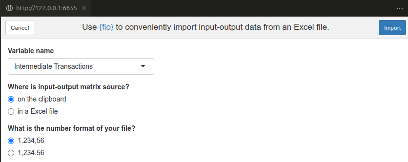

<style>
p.caption {
  font-size: 0.6em;
  text-align: "center";
}
</style>

```{r, include = FALSE}
knitr::opts_chunk$set(
  collapse = TRUE,
  comment = "#>",
  fig.align = "center",
  out.width = "70%"
)

set.seed(123)
```

# Introduction

Transitioning from more familiar, spreadsheet-based data management tools like Excel to R can present a steep learning curve for beginners. Recognizing this challenge, the {fio} package has been developed to bridge the gap, making it easier for students, analysts, and casual users to leverage the power of R for their input-output analysis.

The {fio} package simplifies the process of importing and managing input-output matrix data from Excel into R. This is particularly beneficial for those in the field of economics that relies on input-output analysis for understanding the flow of goods and services within an economy. By providing tools for both interactive and programmatic data import, {fio} ensures that users can choose the method that best fits their workflow and project needs. Along with easy of use, other base principles of {fio} design are clarity of computation (only doing what the user asks) and documentation (functions should clearly state their purpose without the user needing to read the source code). 

This guide aims to introduce you to the core features of {fio}, guiding you through the process of importing data from Excel, understanding the structure of the `iom` class, and utilizing {fio}'s functionalities to perform comprehensive input-output analysis with ease.

# Importing data from Excel

One of the key aspects of {fio} is its ease of use. We were all beginners at some point, and data wrangling can be challenging. Although R is highly permissive with types and arguments—often outputting incorrect values or types instead of throwing an error—it still requires some effort for casual users to get data ready for use. Therefore, {fio} aims to reduce the initial hurdles for students or analysts who are transitioning from Excel-based input-output analysis to R.

This session focuses on using {fio} to import input-output matrix data from Excel, either interactively via an add-in or programmatically. By interactive import, I mean importing data from an open Excel spreadsheet, with the user selecting which rows and columns to import. This method is recommended for small, one-time, non-reproducible data imports. For larger imports, or when the data is to be used in a reproducible workflow, programmatic import is recommended.

## Interactive import

To use the Import input-output data add-in, select the **Import input-output data** option from the Addins menu if you are an RStudio user. If you are using VSCode, open the command palette (F1 or Ctrl+Shift+P), select **R: Launch RStudio Addin**, and then choose **Import input-output data**. You can also call the add-in directly by running `fio:::fio_addin()`.

```{r addin, fig.cap="Import input-output data addin", echo=FALSE}

```

Every chunk of data imported via the add-in is stored in the global environment, under the name specified in the `Variable name` field. If a name is not provided, select `Custom` and type the desired name in the `Custom variable name` field.

When "on the clipboard" is selected (default), simply copy the data in your Excel spreadsheet and click the `Import` button. The data will be imported into R.

When "in an Excel file" is selected, you must provide the path to the Excel file in the `Source file` field. Additionally, you need to specify the sheet name and the range of cells to import. Optionally, you can provide column or row name cell ranges.

## Programmatic import

Under the hood, the add-in uses the `import_element()` function, which is recommended for scripts and reproducible workflows. The function has the following arguments:

```r
variable_name = fio::import_element(
 file = "path/to/file.xlsx",
 sheet = "sheet_name",  # sheet name
 range = "B2:Z56",      # cell range for data
 col_names = "B2:Z2",   # cell range for column names
 row_names = "A2:A56"   # cell range for row names
)
```

This function allows you to specify the file path, sheet name, and cell ranges for the data, column names, and row names, providing a robust method for importing data programmatically.

# The `iom` class

`iom` is an R6 class serving as the primary data structure used by {fio} to store input-output data. It includes both required and optional fields. The required fields are necessary for computing technical coefficients, the Leontief inverse matrix, and output multipliers. To compute additional features, you can add final demand and value-added fields, some of which have dedicated slots for computing specific multipliers. Additionally, there are slots for storing the results of various functions, such as the technical coefficients matrix, the Leontief inverse, key sectors, the Ghosh inverse, and more. You can check all available slots and methods of the `iom` class in the [package documentation](https://albersonmiranda.github.io/fio/reference/iom.html).

In order to instantiate a new `iom` object, as every R6 class^[For a gentle introduction to R6, see [R6 for beginners](https://mlr3book.mlr-org.com/chapters/chapter1/introduction_and_overview.html#sec-r6) (Bischl et al., 2024).], you need to use the `new()` method. A new `iom` object requires an `id` to help you identify the object (especially when you have multiple `iom` objects in your environment), a `intermediate_transactions` matrix, and a `total_production` vector. The other slots are optional and can be filled (or removed) later if needed with `add()` and `remove()` methods.

Let's create a new `iom` object with some random data:

```{r new}
# Create a new iom object
my_iom <- fio::iom$new(
  id = "my_iom",
  intermediate_transactions = matrix(as.numeric(sample(100:1000, 25)), nrow = 5),
  total_production = matrix(as.numeric(sample(5000:10000, 5)), nrow = 1)
)

print(my_iom)
```

For now, `intermediate_transactions` and `total_production` are the only not `NULL` slots. We can compute the technical coefficients matrix by calling the `compute_tech_coeff()` method:

```{r tech_coeff}
# Compute technical coefficients matrix
my_iom$compute_tech_coeff()

print(my_iom)
```

Now the `technical_coefficients_matrix` slot is filled. You can access the slots using the `$` operator:

```{r access}
# Access slots
print(my_iom$technical_coefficients_matrix)
```

Other methods available are `compute_leontief_inverse()`, `compute_multiplier_output()`, `compute_influence_field()`, `compute_key_sectors()`, `compute_allocation_coeff()`, `compute_hypothetical_extraction()` and `compute_ghosh_inverse()`. Their names are clear and self explanatory. You can also chain these methods to do all at once:

```{r chain}
# Chain methods
my_iom$compute_tech_coeff()$compute_leontief_inverse()$compute_key_sectors()

print(my_iom$key_sectors)
```

# References

Bernd Bischl, Raphael Sonabend, Lars Kotthoff, & Michel Lang (2024). Applied Machine Learning Using mlr3 in R. CRC Press.
